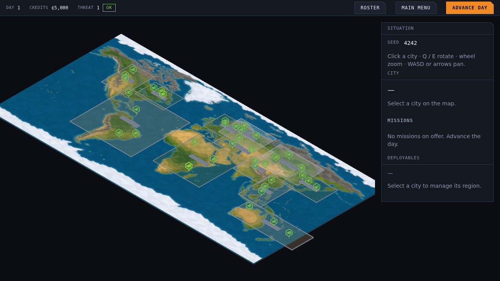
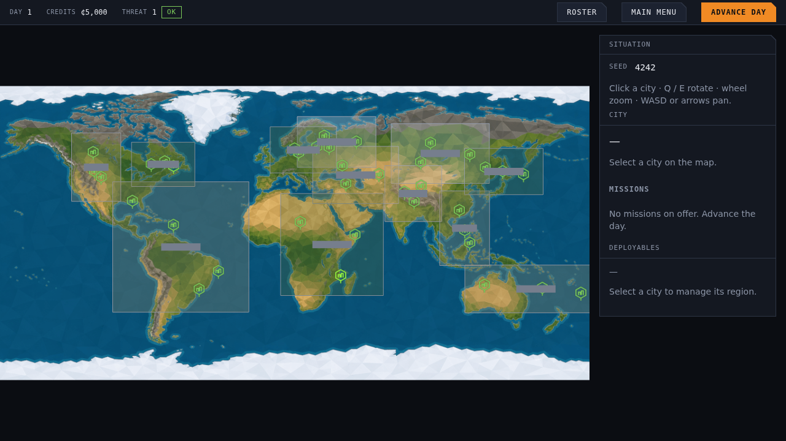

# ADR 0005: The strategic map camera is top-down; tactical stays isometric

- **Status:** Accepted; amended by §5 (2026-09-16)
- **Date:** 2026-09-04
- **Author:** Tech Lead
- **Requested by:** Executive Director (#420)
- **Scope:** Architecture §5 (camera contract); `graphics/model/camera-state.ts`, `graphics/service/orthographic-camera-rig.ts`, `graphics/service/camera-math.ts`, the overworld scene

## 1. Context

One orthographic rig has drawn both screens since M0. It was built for the
tactical map, so its elevation angle (`atan(1/√2)`, true isometric) and its
four yaw orientations (the diagonals) were module constants rather than
inputs, and the strategic map inherited them.

That is right for a mission: ADR 0004 §3 fixes the tactical map's coordinate
system, and its tiles, walls and props are modelled to read from a
three-quarter view. It is wrong for Earth. Seen down a diagonal, the map
plate is a rhombus, north points up and to the left, and the continents
shear. The Executive Director asked for the strategic map "more flat front
on, just like XCOM", and for city markers that line up with their cities
(#420).

The markers were the same problem seen twice. A marker's glyph was a sprite
anchored at its bottom edge, so it drew entirely *above* its city in screen
space: the pin's tip was on the city but the body a marker-height away, over
the wrong piece of terrain.

Before and after, same seed and viewport:

| Isometric (before) | Top-down (after) |
|---|---|
|  |  |

## 2. Decision

### 2.1 Projection is state, not a constant

`CameraState` (named `IsometricCameraState` when this ADR was written; see the consequences) gains an optional `CameraProjection { elevationRad,
yawOffsetRad }`. Two are shipped:

| Projection | Elevation | Yaw offset | Used by |
|---|---|---|---|
| `ISOMETRIC_PROJECTION` | `atan(1/√2)` ≈ 35.26° | π/4 (diagonals) | tactical maps, the mapgen preview |
| `TOP_DOWN_PROJECTION` | π/2 (straight down) | π/2 (axes) | the strategic map |

Absent means isometric, so every caller written before this ADR keeps the
view it was written for. The camera math reads the projection for placement,
for the ground-plane screen axes and for pan foreshortening, so a
straight-down camera pans one world unit per `zoom` pixels in both axes
while the tactical camera keeps its `1/sin(elevation)` stretch.

### 2.2 The strategic map does not rotate

North stays up. `CameraInputController` takes `{ rotate: false }` for the
overworld, leaving pan and zoom. Rotating a world map to "east up" is not a
view anyone wants, and the Earth texture is not symmetric under it.

### 2.3 Straight down needs a different up vector

three's `lookAt` builds its basis from a hint, and world `+y` is parallel to
the view direction of a camera looking straight down, which leaves it
without one. `screenUpVector` returns the ground plane's screen-up axis for
a top-down camera and `+y` for any tilted one, which is what the rig hands
the camera. This is why the elevation is a projection rather than "just a
number to change".

### 2.4 Markers sit on their cities

The strategic map is now read the way a map is read, so a city marker is
centred on its city rather than standing on it, and its pick point is the
city's own position. The mission badge offsets **across the ground plane**
(east and north) rather than along `+y`: under a top-down camera an offset
in `+y` points at the viewer and produces no screen movement at all.

Since #1155 the marker is a settlement model and the mission badge is an
egg overlay drawn at the same origin as the model; the rule stands, since
everything a marker draws still sits on the ground plane around the city.

## 3. Consequences

- Anything drawn for the strategic map must place itself on the ground
  plane. Height is now depth toward the camera, not screen-up. The next
  thing to hit this is region labels, if they are ever drawn in 3D rather
  than in the DOM panel.
- The tactical view is untouched: same elevation, same four yaws, same pan
  feel, and the tactical specs pass unchanged.
- `e2e/overworld-orientation.spec.ts` pins the contract from the outside:
  east is right, south is down, one scale for the whole map. It fails
  against the isometric camera, which is what makes it worth having.
- The rig and its state were left named `Isometric*` here although one of
  the two projections is not isometric, because renaming ripples through
  the tactical host, the preview harness and their tests, and this change
  was one the Executive Director was waiting on. #424 has since done that
  rename: `OrthographicCameraRig`, `CameraState`, `camera-math.ts`. The
  `ISOMETRIC_PROJECTION` and `ISOMETRIC_ELEVATION_RAD` constants keep their
  names, since those genuinely are isometric.

## 4. Alternatives considered

- **Tilt the strategic camera a little instead of flat.** A 60–70° elevation
  would keep some depth. It reads as neither a map nor a diorama, and the
  request was "more flat". The elevation is one number in one constant if
  the Executive Director wants it back.
- **A second rig for the overworld.** Two rigs means two pan, zoom, bounds
  and picking implementations, which is the duplication #369 had just
  finished removing from picking.
- **Keep the pin anchoring and only change the camera.** The pin would still
  draw a marker-height above its city; the Executive Director asked about
  exactly that.

## 5. Addendum (2026-09-16): pitched back 35°, still north up

The Executive Director, looking at the settlement models #1155 put on
the map, asked for the display tilted "to look nice". Seen straight
down, a settlement is its roofs: a grey tile grid with no skyline, and
the building fronts, which is where a model's silhouette and its lit
windows live, are edge-on.

The strategic map now uses `STRATEGIC_PROJECTION`: elevation 55° (a
pitch of `STRATEGIC_PITCH_RAD`, 35°, back from vertical), yaw offset
π/2, so the camera sits due **south** of its target and looks north.

| Projection | Elevation | Yaw offset | Used by |
|---|---|---|---|
| `STRATEGIC_PROJECTION` | 55° | π/2 (from the south) | the strategic map |
| `TOP_DOWN_PROJECTION` | 90° | π/2 | kept; the previous strategic view |

What §2 said still holds, because everything was written against the
projection rather than against "straight down":

- North is still screen-up and east screen-right (§2.2); the map does
  not rotate. The plane simply foreshortens by `sin 55°` ≈ 0.82 up the
  screen, so a 2:1 plate draws at about 2.44:1.
- `panBy` divides screen-up by `sin(elevation)`, so a drag still tracks
  the ground exactly; `cameraPosition` places the camera south and
  above; `screenUpVector` hands three world `+y` since the view is no
  longer parallel to it (§2.3).
- Picking, `cityScreenPosition` and `installationScreenPosition` all
  go through the camera's own matrices, so the city wheel (ADR 0007)
  still anchors to its marker.
- Markers still sit on their cities (§2.4). Ground-hugging layers (the
  wireframe, the territory fill, the halo and selection rings) stay
  flat on the plane and draw as ellipses; a settlement's height now
  reads as height, `cos 55°` ≈ 0.57 of a unit per unit.

The camera is due south rather than on a slight yaw so the map stays
axis-aligned; the settlement models are authored with a small yaw of
their own so two faces of each building show under it.
