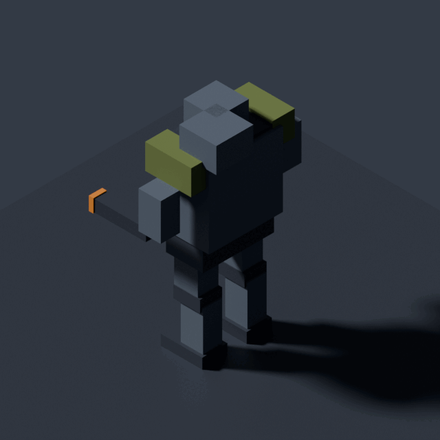
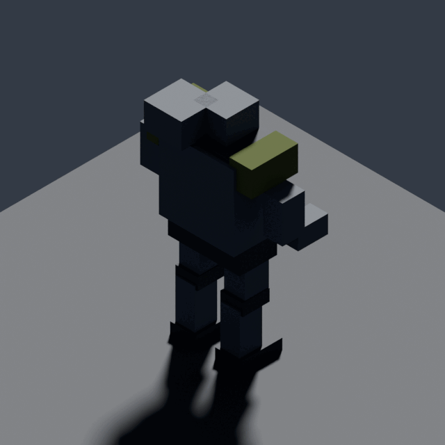

# Blender toolchain proof (#190)

Output of `blender -b --python tools/art/smoke_render.py` on the Art Director instance with Blender 4.5.13 LTS, Cycles on CPU, 32 samples, 640 px, no display and no GPU. The script builds a block mech from `bpy` primitives, exports `smoke-mech.glb` (+Y up, pivot at base centre), validates it with trimesh inside Blender's own Python, and renders three fixed isometric yaws. `report.json` is the machine-readable result; the PNGs here are the 256-colour copies of the renders.

| 45° | 135° | 225° |
|---|---|---|
|  |  |  |

Whole run: about 3 s on 32 cores. Standalone validation of any GLB: `art-python tools/art/validate_glb.py <file.glb>`.
