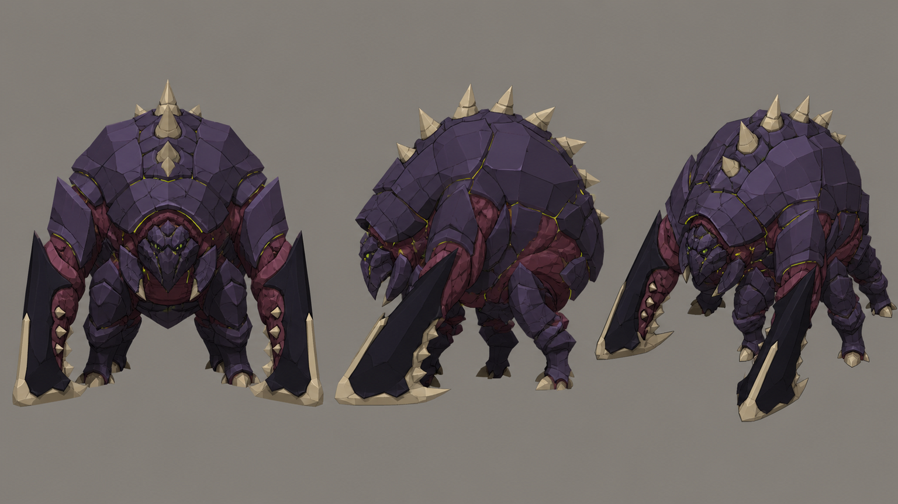

# Concept: Bug: brute



- **Generator**: Codex CLI 0.152.1 built-in `image_gen` (model gpt-5.6-sol session; image model as served by the tool), via `tools/art/gen-image.sh`.
- **Date**: 2026-09-02
- **Prompt file**: [`prompts/bug-brute.txt`](prompts/bug-brute.txt) (exact text passed to the generator, plus the standard save-path suffix the script appends)
- **Style guide refs**: §3 scale/silhouette, §4 palette

## Prompt

```
Concept sheet for an alien bug creature called a brute, from a near-future Earth turn-based tactics game. A massive, slow, heavily armoured chitinous creature about 3.6 metres tall and nearly as wide: a domed carapace like a boulder with the head sunk into the chest, thick short legs, two enormous cleaver-like blade forelimbs dragging on the ground, and bone spikes along the dome. Sharp, bladed, chitinous; an original design in the Tyranid and Zerg silhouette family, not a copy of either. Colours: body dark chitin #2B2436, plate highlights #4A3B5A, blade backs #14121A, blade edges and spikes bone #D8CBB0, exposed flesh between plates #7A3A4E, small bright bioluminescent green #9CFF3D eyes and plate seams. Low-poly game model style, flat shading, hard edges, clean vector-like fills with no gradients or noise, plain neutral grey background #8E8A82, no text, no labels, no watermark, no logos. Wide landscape concept sheet showing the same design three times side by side: front view, side view, and isometric three-quarter view from 35 degrees above.
```

## Keep

- Boulder dome with head sunk into the chest, bone spikes along the carapace, two enormous cleaver blades dragging on the ground, exposed flesh between plates. Reads as a rock from the back view, which is what we want at range.

## Change next pass

- Eyes are too small to read at isometric distance; the model should get a single wide green slit.
- Flesh red is more prominent than the palette intends; keep flesh to the seams on the model.
