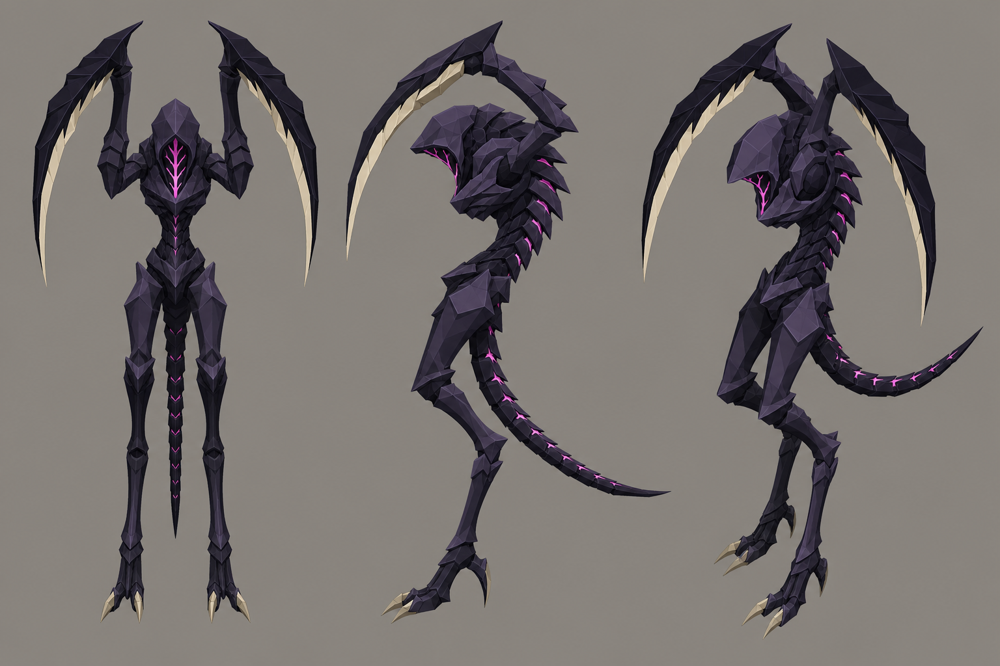

# Concept: Bug: lurker



- **Generator**: Codex CLI 0.152.1 built-in `image_gen` (model gpt-5.6-sol session; image model as served by the tool), via `tools/art/gen-image.sh`.
- **Date**: 2026-09-02
- **Prompt file**: [`prompts/bug-lurker.txt`](prompts/bug-lurker.txt) (exact text passed to the generator, plus the standard save-path suffix the script appends)
- **Style guide refs**: §3 scale/silhouette, §4 palette

## Prompt

```
Concept sheet for an alien bug creature called a lurker, from a near-future Earth turn-based tactics game. A tall, thin, forward-leaning chitinous stalker about 2.6 metres tall on two long digitigrade legs, with two very long scythe-blade arms held up and forward, a narrow waist, a small hooded head with no visible eyes, and a long counterbalancing tail. Its silhouette reads like a question mark. Sharp, bladed, chitinous; an original design in the Tyranid and Zerg silhouette family, not a copy of either. Colours: body dark chitin #2B2436, plate highlights #4A3B5A, blade backs #14121A, blade edges bone #D8CBB0, thin bright bioluminescent magenta #E23DFF markings along the spine and under the hood. Low-poly game model style, flat shading, hard edges, clean vector-like fills with no gradients or noise, plain neutral grey background #8E8A82, no text, no labels, no watermark, no logos. Wide landscape concept sheet showing the same design three times side by side: front view, side view, and isometric three-quarter view from 35 degrees above.
```

## Keep

- Question-mark silhouette: forward-leaning, narrow waist, hooded eyeless head, two long scythe blades held up, counterbalancing tail. Magenta spine markings, bone blade edges. Reference-quality.

## Change next pass

- Blade arms are longer than the body; for the 1.3 u model keep them at roughly 0.7 u so they stay inside the tile at rest.
- Feet claws could be simplified to a single wedge.
