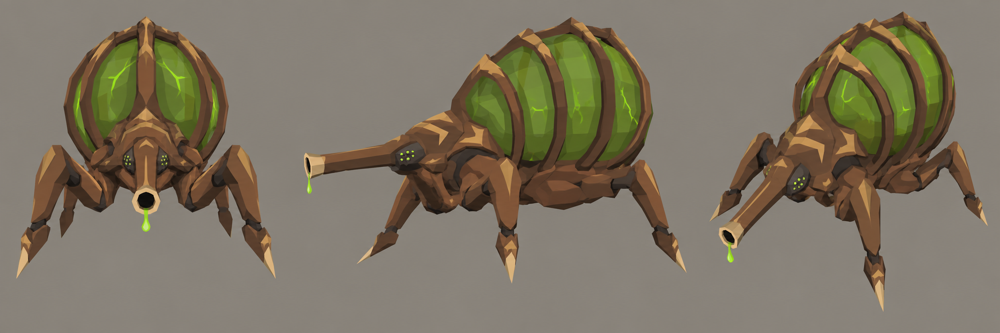

# Concept: Bug: spitter



- **Generator**: Codex CLI 0.157.1 built-in `image_gen` (image model as served by the tool), via `tools/art/gen-image.sh`.
- **Date**: 2026-09-26
- **Asset**: `bug-spitter.png`, 2172×724, unmodified tool output.
- **Prompt file**: [`prompts/bug-spitter.txt`](prompts/bug-spitter.txt) (exact text passed to the generator, plus the standard save-path suffix the script appends)
- **Style guide refs**: §3 scale/silhouette, §4.2 bug palette (brown family), [brown bug kit](../kits/crescent-bugs.md)

## Prompt

```
Concept sheet for an alien bug creature called a spitter, from a near-future Earth turn-based tactics game. A ranged acid artillery bug about 1.8 metres tall and 2 metres long, from the same brown insect family as a low crescent-hooded swarmer and a domed beetle brute, but with its own silhouette: a compact armoured forebody on four splayed, jointed walking legs, a short neck ending in a long forward-pointing tubular spout like a cannon barrel or a proboscis, and behind it a huge bloated translucent acid sac that swells up and over the back, held in a cage of curved chitin ribs. The sac glows faintly from inside with acid; a drip hangs from the spout tip. Small paired eye clusters either side of the spout base. It reads like a tick crossed with a bombardier beetle and a mortar. Sharp, chitinous, organic; an original design in the Tyranid and Zerg silhouette family, not a copy of either. Colours: walnut-brown primary shell #5C3B25, chestnut plates and limb armour #8B5D36, dark umber joints, rib backs and eye recesses #2E2118, toasted tan dorsal markings on the rib cage and forebody #B88B58 with sandy highlights #C6A275, russet flesh between plates #73452E, pale horn spout lip and toe tips #DDC39B, acid sac a murky dim green #4C8F1A with small vivid bioluminescent acid-green #9CFF3D veins, eyes and spout drip (small and bright, never a wash). No purple, violet, blue or magenta. Low-poly game model style, flat shading, hard edges, clean vector-like fills with no gradients or noise, plain neutral grey background #8E8A82, no text, no labels, no watermark, no logos. Wide landscape concept sheet showing the same design three times side by side: front view, side view, and isometric three-quarter view from 35 degrees above.
```

## Keep

- The silhouette nothing else in the family has: a caged, bloated green acid sac arching over the back, read from any angle and at tactical size. The sac's dim green with thin bright veins is the species' signature, the way the crescent hood is the swarmer's.
- A long forward spout with a pale horn lip and a green drip: it tells the player "this one shoots" before they read its card.
- Four splayed, jointed legs with pale toe tips; walnut and chestnut shell with tan chevrons on the forebody; paired green eye clusters beside the spout base.

## Change next pass

- For the 3D model keep the sac within about 0.9 u tall and the spout within the tile at rest, so the spitter stands between the swarmer (0.5 u) and the lurker (1.3 u).
- The sac is drawn much wider than the forebody; keep it no wider than the leg stance so it does not overhang the neighbouring tile.

## In game

`docs/design/bug-spitter-idle.png` and `docs/design/bug-spitter-firing.png`
are the model in a live mission on the dev server (#1179). The starter
force stands in a line on a flat field, with a crate one tile west of the
spitter's tile. The spitter was put down with the debug menu's Spawn tool
(`PlaceUnit`), and then the turn was ended on a paused clock
(`page.clock`) and stepped a frame at a time.

It held its tile behind the crate and spat at Delta six tiles away:
one `AttackResolved`, `weaponRange` 6, and no move. The firing frame
catches the tracer in flight.

The tracer and flash are the generic white ones every ranged shot
uses. An acid-green tint for bug spits is a presentation follow-up.
