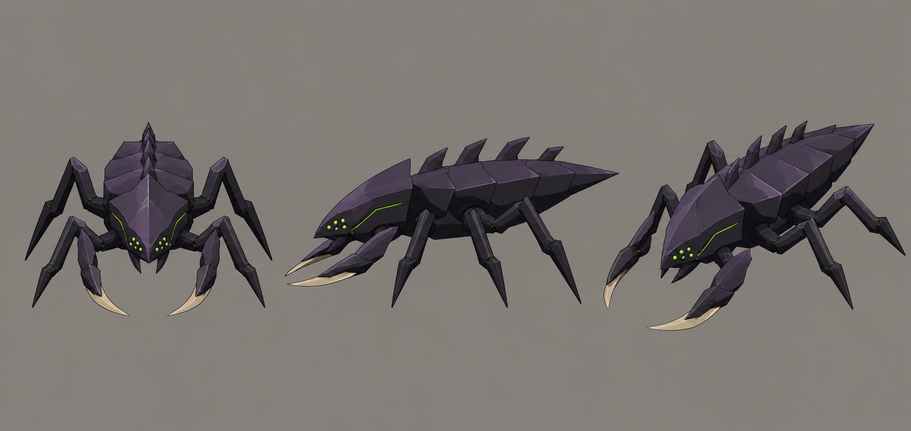

# Concept: Bug: swarmer



- **Generator**: Codex CLI 0.152.1 built-in `image_gen` (model gpt-5.6-sol session; image model as served by the tool), via `tools/art/gen-image.sh`.
- **Date**: 2026-09-02
- **Prompt file**: [`prompts/bug-swarmer.txt`](prompts/bug-swarmer.txt) (exact text passed to the generator, plus the standard save-path suffix the script appends)
- **Style guide refs**: §3 scale/silhouette, §4 palette

## Prompt

```
Concept sheet for an alien bug creature called a swarmer, from a near-future Earth turn-based tactics game. A low, fast, six-legged chitinous creature about 1 metre tall and 1.6 metres long: the body is a horizontal wedge with the head held low, a row of short spines along the back, two forelimbs ending in short curved blades instead of hands, a cluster of small eyes. Sharp, bladed, chitinous; an original design in the Tyranid and Zerg silhouette family, not a copy of either. Colours: body dark chitin #2B2436 with plate highlights #4A3B5A and deepest blade backs #14121A, blade edges bone #D8CBB0, small bright bioluminescent green #9CFF3D eyes and thin glowing vein lines. Low-poly game model style, flat shading, hard edges, clean vector-like fills with no gradients or noise, plain neutral grey background #8E8A82, no text, no labels, no watermark, no logos. Wide landscape concept sheet showing the same design three times side by side: front view, side view, and isometric three-quarter view from 35 degrees above.
```

## Keep

- Horizontal wedge silhouette with head low; six legs; two short bone-edged forelimb blades; dorsal spines; green eye cluster and vein line. Exactly the arrow-shaped read the style guide asks for.

## Change next pass

- Legs are long and spidery; shorten them so the body sits lower (0.5 u) and the unit reads as a rushing wedge rather than a spider.
- Add the second colour (chitin-mid) on plate highlights; the sheet is mostly one purple.
