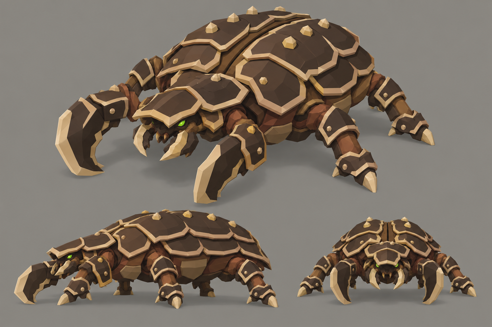

# Concept: Armoured brute



- **Status:** accepted on attempt 2 (regenerated 1×; rejected attempts are not committed, see below).
- **Generator:** Codex CLI 0.157.1 (`codex exec`), built-in `image_gen` through its imagegen skill; image model as served by the tool, via `tools/art/gen-image.sh`.
- **Date:** 2026-09-26
- **Asset:** `armoured-brute.png`, 1536×1024, unmodified tool output. Documentation only, not a runtime asset.
- **Prompt file:** [`prompts/armoured-brute.txt`](prompts/armoured-brute.txt): the exact text passed to the generator, plus the standard save-path suffix the script appends.
- **Modeller brief:** [campaign bestiary](../../kits/campaign-bestiary.md#armoured-variants)
- **Campaign arc:** §8 bestiary (Act III armoured variants), §10 autopsy (armour-piercing rounds)

## Prompt

```
Concept sheet for the armoured brute, a late-game armoured variant of the brute bug from Terra Under Threat, a near-future Earth turn-based tactics game played from an isometric camera. Base brute: a low, very wide beetle about 3.6 metres long and 1.8 metres tall on a 4 by 4 metre footprint, one domed vault formed by paired oval wing cases with a narrow dorsal seam, two broken rows of tan back markings, six jointed legs planted wide, and a low forward head with mandibles between two heavy cleaver forelimbs; small bright green #9CFF3D eyes. Keep the base species body plan, limb count, proportions and outline exactly, and add heavy armour on top: thick overlapping slab plates in dark umber #2E2118 with bevelled pale horn #DDC39B rims, layered like scale armour over the brown shell, with small knobbed bosses where plates overlap. The armour makes the creature visibly bulkier and darker, and the bright pale rims outline every plate so the armour reads from far away at small size. On the armoured brute: the wing cases are covered by thick overlapping armour slabs like a tortoise shell of plates, with the tan markings kept as raised studs; a heavy armoured brow plate juts over the head like a battering ram; the six legs wear armour cuffs; and the cleavers are backed with thick dark plates. Colours, hexes exact: walnut-brown primary shell #5C3B25, chestnut overlapping plates and limb armour #8B5D36, dark umber joints, undersides and blade backs #2E2118, broad toasted-tan markings and shell lips #B88B58, sandy shell highlights #C6A275, russet tissue between plates #73452E, pale horn cutting edges, spines and toe tips #DDC39B. No purple, violet or blue on the creature. Crisp stylized low-poly game model style: large faceted planes, hard edges, flat shading, clean vector-like fills with no noise, grain or painterly texture, matte organic chitin. Not photoreal and not a glossy 3D render. Bioluminescent spots are small, crisp and few. Background: a flat, evenly and brightly lit mid-grey #8E8A82 studio backdrop, exactly the same light grey at every edge and corner, like a product shot on grey card; the only shading on it is a small soft grey contact shadow under each view. No scenery, no ground plane, no props. No text, no labels, no captions, no watermark, no logos, no borders or panels. Wide landscape 3:2 concept sheet of the same single design, all views at the same scale: one large isometric three-quarter view from 35 degrees above filling the top two-thirds, and below it a clean side-profile view and a smaller front view, evenly spaced.
```

## Keep

- A tortoise-shell of overlapping dark slabs with pale rims over the paired wing cases; the dorsal seam kept; tan markings as raised studs.
- A battering-ram brow plate over the head, armour cuffs on the six legs, cleavers backed by thick dark plates.

## Change on the model

- Keep the shipped brute's 2×2 footprint and 0.9 u height; the armour adds at most 0.1 u. Build it from `brute_parts.py` so the leg and cleaver pivots match.

## Attempts

- **v1:** rejected: the backdrop came out as a dark vignette with a warm glow halo round the creature instead of flat grey. The design matched this one. The background sentence was reworded for v2.
- **v2:** accepted (this image).
