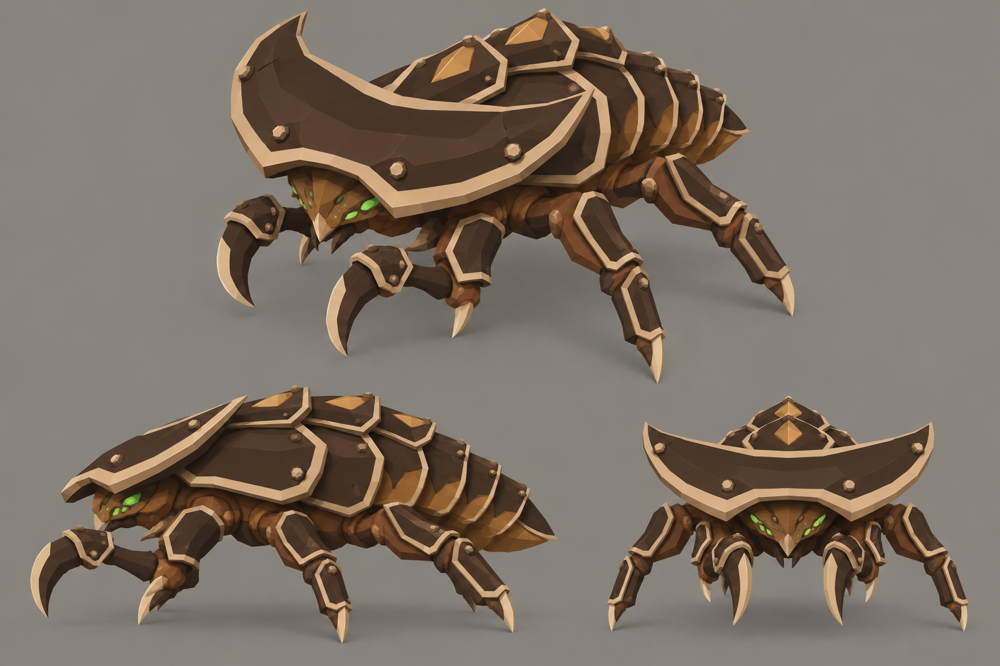

# Concept: Armoured swarmer



- **Status:** accepted on the first attempt.
- **Generator:** Codex CLI 0.157.1 (`codex exec`), built-in `image_gen` through its imagegen skill; image model as served by the tool, via `tools/art/gen-image.sh`.
- **Date:** 2026-09-26
- **Asset:** `armoured-swarmer.png`, 1536×1024, unmodified tool output. Documentation only, not a runtime asset.
- **Prompt file:** [`prompts/armoured-swarmer.txt`](prompts/armoured-swarmer.txt): the exact text passed to the generator, plus the standard save-path suffix the script appends.
- **Modeller brief:** [campaign bestiary](../../kits/campaign-bestiary.md#armoured-variants)
- **Campaign arc:** §8 bestiary (Act III armoured variants), §10 autopsy (armour-piercing rounds)

## Prompt

```
Concept sheet for the armoured swarmer, a late-game armoured variant of the swarmer bug from Terra Under Threat, a near-future Earth turn-based tactics game played from an isometric camera. Base swarmer: a fast, low insect about 1.8 metres long and 1 metre tall under a broad thin crescent-shaped shield hood with swept rear corners, a low recessed head, a short segmented abdomen of five overlapping plates, four running legs and two short hooked blade forearms, walnut and chestnut shell with toasted-tan diamond-shaped dorsal lozenges, a light tan shield lip and small bright green #9CFF3D eyes and breathing slits. Keep the base species body plan, limb count, proportions and outline exactly, and add heavy armour on top: thick overlapping slab plates in dark umber #2E2118 with bevelled pale horn #DDC39B rims, layered like scale armour over the brown shell, with small knobbed bosses where plates overlap. The armour makes the creature visibly bulkier and darker, and the bright pale rims outline every plate so the armour reads from far away at small size. On the armoured swarmer: the crescent hood is doubled by a second thick dark armour layer with a pale rim, a raised spine of three overlapping slabs runs down the back with the tan lozenges set into it as studs, the abdomen plates are thickened, and the upper legs and hooked forearms wear armour cuffs. Colours, hexes exact: walnut-brown primary shell #5C3B25, chestnut overlapping plates and limb armour #8B5D36, dark umber joints, undersides and blade backs #2E2118, broad toasted-tan markings and shell lips #B88B58, sandy shell highlights #C6A275, russet tissue between plates #73452E, pale horn cutting edges, spines and toe tips #DDC39B. No purple, violet or blue on the creature. Crisp stylized low-poly game model style: large faceted planes, hard edges, flat shading, clean vector-like fills with no noise, grain or painterly texture, matte organic chitin. Not photoreal and not a glossy 3D render. Bioluminescence is small and bright, never a wash. Background: one uniform flat mid-grey #8E8A82 from edge to edge, like a studio card: no vignette, no gradient, no dark corners, no glow or halo around the subject, only a soft grey contact shadow under each view; no scenery, no ground plane, no props. No text, no labels, no captions, no watermark, no logos, no borders or panels. Wide landscape 3:2 concept sheet of the same single design, all views at the same scale: one large isometric three-quarter view from 35 degrees above filling the top two-thirds, and below it a clean side-profile view and a smaller front view, evenly spaced.
```

## Keep

- The crescent hood doubled by a thick dark armour layer with a pale horn rim; the tan lozenges kept as raised studs down the back.
- Dark umber slab plates with bevelled bone rims and knobbed bosses on the abdomen, legs and hooks. The variant reads darker, with bright rims, where the base swarmer reads mid-brown.

## Change on the model

- The sheet draws six legs. Keep the shipped `bug.swarmer` anatomy (four running legs, two hooks) and add armour to it; build it from `bug_parts.py` so the pivots match.
- Run the asphalt, grass and rock read tests (style guide §4.2.1): the darker shell needs its pale rims to separate on asphalt.
