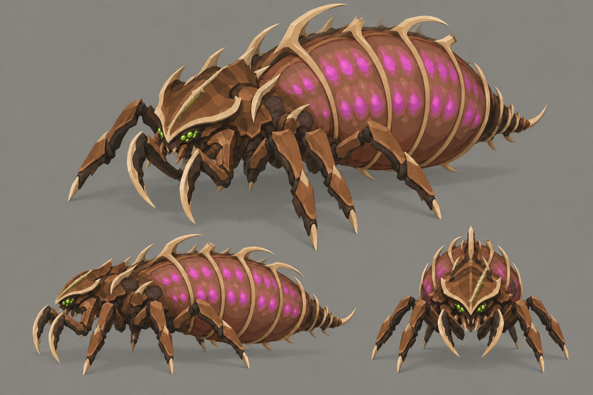

# Concept: Broodmother, scarred nemesis



- **Status:** accepted on the first attempt.
- **Generator:** Codex CLI 0.157.1 (`codex exec`), built-in `image_gen` through its imagegen skill; image model as served by the tool, via a scratch copy of `tools/art/gen-image.sh` that adds `-i docs/design/concepts/campaign/broodmother.png` to its `codex exec` call (the repository script takes no reference image); otherwise identical, including the appended save-path suffix.
- **Date:** 2026-09-26
- **Asset:** `broodmother-scarred.png`, 1536×1024, unmodified tool output. Documentation only, not a runtime asset.
- **Prompt file:** [`prompts/broodmother-scarred.txt`](prompts/broodmother-scarred.txt): the exact text passed to the generator, plus the standard save-path suffix the script appends.
- **Modeller brief:** [campaign bestiary](../../kits/campaign-bestiary.md#broodmother)
- **Campaign arc:** §6.8 Alpha Hunt (nemesis record: the briefing names her scar)
- **Reference image:** [`broodmother.png`](../../../../docs/design/concepts/campaign/broodmother.png)

## Prompt

```
Scene/backdrop: a seamless, evenly lit, light neutral grey #8E8A82 studio backdrop, the same light grey in every corner and behind every view, like a clean product sheet.

Edit the attached concept sheet of the broodmother, a boss alien bug from Terra Under Threat, a near-future Earth turn-based tactics game. Keep this exact creature design, its three views, their poses, framing and scale, the flat grey backdrop and the crisp stylized low-poly faceted style. Change only this: she is the scarred nemesis version who escaped the squad once and came back. A long diagonal scar gouged across the left side of her crest-shaped head shield, healed over as a raised seam of pale horn #DDC39B scar tissue; one of the hooked cage spines over her egg sac snapped off to a jagged stump; two cracked chestnut plates on her left flank patched with rough dark umber #2E2118 regrowth; and a small bright green #9CFF3D weeping wound line along the scar. She is otherwise identical: same egg sac with magenta #E23DFF eggs, same legs, sickles and palette (walnut #5C3B25, chestnut #8B5D36, dark umber #2E2118, toasted tan #B88B58, russet #73452E).

Avoid: dark or black background, vignette, spotlight, coloured glow around the silhouette, gore, blood, text, labels, watermark. Keep the Scene/backdrop line when you write the image prompt.
```

## Keep

- Same creature, views and palette as [broodmother](broodmother.md): an image edit of that sheet, not a new design.
- A pale horn scar seam across the left of the crest with a thin green weeping line; snapped cage spines; dark umber regrowth patches on the left flank.

## Change on the model

- At 64 px per tile the scar is two pixels. Exaggerate it: a wide bone-pale stripe across the crest, and remove two whole cage spines so the silhouette itself changes.
