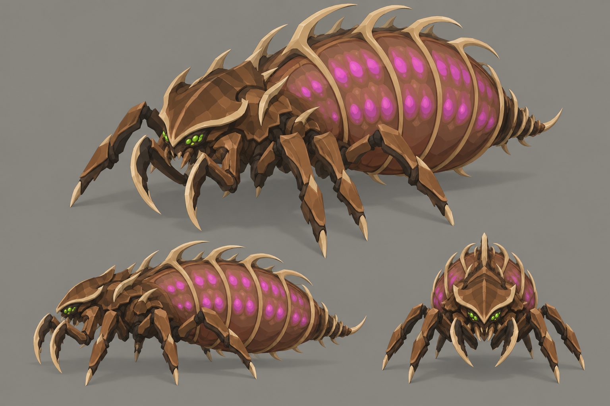

# Concept: Broodmother



- **Status:** accepted on the first attempt.
- **Generator:** Codex CLI 0.157.1 (`codex exec`), built-in `image_gen` through its imagegen skill; image model as served by the tool, via `tools/art/gen-image.sh`.
- **Date:** 2026-09-26
- **Asset:** `broodmother.png`, 1536×1024, unmodified tool output. Documentation only, not a runtime asset.
- **Prompt file:** [`prompts/broodmother.txt`](prompts/broodmother.txt): the exact text passed to the generator, plus the standard save-path suffix the script appends.
- **Modeller brief:** [campaign bestiary](../../kits/campaign-bestiary.md#broodmother)
- **Campaign arc:** §6.8 Alpha Hunt, §8 bestiary, §9 smart enemies

## Prompt

```
Concept sheet for a boss alien bug called the broodmother, from Terra Under Threat, a near-future Earth turn-based tactics game played from an isometric camera. She is a huge mobile egg-layer that roams a region laying clutches of eggs, about 6 metres long and 3.5 metres tall (a little lower than a 5-metre war mech) on a square footprint 6 metres across. Body plan: an armoured front thorax carried on six long, strong walking legs, and behind it an enormous swollen egg sac abdomen, the largest part of her silhouette: a stretched membrane of russet #73452E and light brown #956344 between curved toasted-tan chitin ribs #B88B58, with rows of eggs glowing bright magenta #E23DFF through the membrane. At the rear tip, a short ribbed ovipositor for laying clutches. A protective cage of long hooked pale horn spines curves up from her back and over the egg sac. Her front is armoured and protective: a wide crest-shaped head shield of chestnut plates with a pale horn rim, a low head with two paired green #9CFF3D eye clusters, and two long curved sickle forelimbs held folded in front of her like a guard. She looks maternal, heavy and dangerous, not fast. It belongs to the same creature family as the game's existing bugs, the swarmer (a low insect under a thin crescent-shaped shield hood), the lurker (a thin mantis-like stalker with long sickles) and the brute (a broad beetle with paired oval wing cases and cleavers): the same brown chitin, dark umber joints, tan markings, paired eye clusters and pale horn blade edges, but its own distinct body plan. Colours, hexes exact: walnut-brown primary shell #5C3B25, chestnut overlapping plates and limb armour #8B5D36, dark umber joints, undersides and blade backs #2E2118, broad toasted-tan markings and shell lips #B88B58, sandy shell highlights #C6A275, russet tissue between plates #73452E, pale horn cutting edges, spines and toe tips #DDC39B. No purple, violet or blue on the creature. Crisp stylized low-poly game model style: large faceted planes, hard edges, flat shading, clean vector-like fills with no noise, grain or painterly texture, matte organic chitin. Not photoreal and not a glossy 3D render. Bioluminescence is small and bright, never a wash. Background: one uniform flat mid-grey #8E8A82 from edge to edge, like a studio card: no vignette, no gradient, no dark corners, no glow or halo around the subject, only a soft grey contact shadow under each view; no scenery, no ground plane, no props. No text, no labels, no captions, no watermark, no logos, no borders or panels. Wide landscape 3:2 concept sheet of the same single design, all views at the same scale: one large isometric three-quarter view from 35 degrees above filling the top two-thirds, and below it a clean side-profile view and a smaller front view, evenly spaced.
```

## Keep

- The swollen egg sac is the biggest mass, hooped by tan ribs, with rows of magenta eggs showing through.
- Hooked pale horn cage spines rising along the back and over the sac: the protective read.
- Crest-shaped chestnut head shield with a pale rim, green eye clusters, sickles folded forward like a guard, short ribbed ovipositor with a tail spike.

## Change on the model

- Magenta washes the whole sac on the sheet. On the model the membrane is non-emissive `bug-flesh`/`bug-flesh-light` and only the egg spots are emissive (style guide §4.2: small and bright, never a wash).
- The sheet draws four leg pairs plus sickles; three pairs (`leg_[lr]0..2`) are enough.
- Author at 3×3 and about 1.75 u tall: lower than a mech, far wider than a brute.
