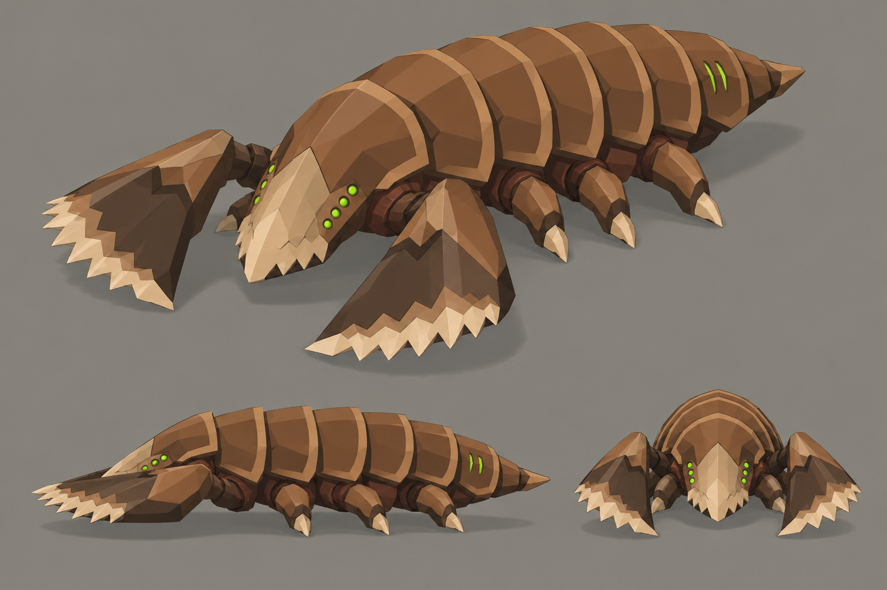

# Concept: Burrower



- **Status:** accepted on attempt 2 (regenerated 1×; rejected attempts are not committed, see below).
- **Generator:** Codex CLI 0.157.1 (`codex exec`), built-in `image_gen` through its imagegen skill; image model as served by the tool, via `tools/art/gen-image.sh`.
- **Date:** 2026-09-26
- **Asset:** `burrower.png`, 1536×1024, unmodified tool output. Documentation only, not a runtime asset.
- **Prompt file:** [`prompts/burrower.txt`](prompts/burrower.txt): the exact text passed to the generator, plus the standard save-path suffix the script appends.
- **Modeller brief:** [campaign bestiary](../../kits/campaign-bestiary.md#burrower)
- **Campaign arc:** §8 bestiary (Act II + 5), §6.7 Tunnel Sabotage

## Prompt

```
Concept sheet for a new alien bug species called the burrower, from Terra Under Threat, a near-future Earth turn-based tactics game played from an isometric camera. The burrower tunnels under the ground and bursts up beside enemy soldiers. Body plan: long, low and segmented, about 2 metres long and under 1 metre tall, hugging the ground like a mole cricket crossed with an armoured pill bug. A blunt wedge-shaped digging head capped by a broad pale horn ploughshare plate. Two huge flat shovel forelimbs shaped like spades with serrated pale horn edges, held forward and splayed either side of the head: this is its signature silhouette. Behind them a thick body of seven overlapping chestnut armour bands, each with a toasted-tan rim, narrowing to a short tapered tail. Four short thick digging legs tucked under the body. It is blind: no large eyes, only a row of small bright green #9CFF3D sensory pits along each side of the head and two thin green breathing slits on the rear bands. It belongs to the same creature family as the game's existing bugs, the swarmer (a low insect under a thin crescent-shaped shield hood), the lurker (a thin mantis-like stalker with long sickles) and the brute (a broad beetle with paired oval wing cases and cleavers): the same brown chitin, dark umber joints, tan markings, paired eye clusters and pale horn blade edges, but its own distinct body plan. Colours, hexes exact: walnut-brown primary shell #5C3B25, chestnut overlapping plates and limb armour #8B5D36, dark umber joints, undersides and blade backs #2E2118, broad toasted-tan markings and shell lips #B88B58, sandy shell highlights #C6A275, russet tissue between plates #73452E, pale horn cutting edges, spines and toe tips #DDC39B. No purple, violet or blue on the creature. Crisp stylized low-poly game model style: large faceted planes, hard edges, flat shading, clean vector-like fills with no noise, grain or painterly texture, matte organic chitin. Not photoreal and not a glossy 3D render. Bioluminescence is small and bright, never a wash. Background: one uniform flat mid-grey #8E8A82 from edge to edge, like a studio card: no vignette, no gradient, no dark corners, no glow or halo around the subject, only a soft grey contact shadow under each view; no scenery, no ground plane, no props. No text, no labels, no captions, no watermark, no logos, no borders or panels. Wide landscape 3:2 concept sheet of the same single design, all views at the same scale: one large isometric three-quarter view from 35 degrees above filling the top two-thirds, and below it a clean side-profile view and a smaller front view, evenly spaced.
```

## Keep

- Long, low body of seven overlapping chestnut bands with tan rims, like a pill bug: nothing else in the family is banded end to end.
- Two huge flat spade forelimbs with serrated pale horn edges, splayed forward either side of the head. They are the read at 64 px per tile.
- Pale horn ploughshare plate over a blunt wedge head; rows of small green sensory pits instead of eyes; two green breathing slits on the rear band; short tail spike.

## Change on the model

- The sheet draws three legs a side; six legs (`leg_[lr]0..2`) are fine for the rig, four are enough.
- Fit shovels and body inside one tile: the sheet's body is about 2.2 times as long as it is wide, so lay it along the tile diagonal or shorten the tail.
- Close the underside: the model is sunk through the ground for burrow and surface moves, and the band edges must still read when only the top half shows.

## Attempts

- **v1:** rejected: the backdrop came out as a dark vignette with a warm glow halo round the creature instead of flat grey; the design itself matched this one (spade forelimbs, banded back, pits for eyes). The background sentence was rewritten for v2.
- **v2:** accepted (this image).
