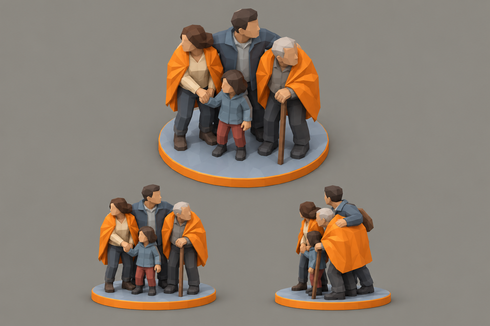

# Concept: Civilian group



- **Status:** accepted on attempt 2 (regenerated 1×; rejected attempts are not committed, see below).
- **Generator:** Codex CLI 0.157.1 (`codex exec`), built-in `image_gen` through its imagegen skill; image model as served by the tool, via `tools/art/gen-image.sh`.
- **Date:** 2026-09-26
- **Asset:** `civilian-group.png`, 1536×1024, unmodified tool output. Documentation only, not a runtime asset.
- **Prompt file:** [`prompts/civilian-group.txt`](prompts/civilian-group.txt): the exact text passed to the generator, plus the standard save-path suffix the script appends.
- **Modeller brief:** [campaign bestiary](../../kits/campaign-bestiary.md#civilian-group)
- **Campaign arc:** §6.4 Evacuation

## Prompt

```
Scene/backdrop: a seamless, evenly lit, light neutral grey #8E8A82 studio backdrop, the same light grey in every corner and behind every view, like a clean product sheet.

Concept sheet for a group of civilians waiting to be rescued, a friendly unit token from Terra Under Threat, a near-future Earth turn-based tactics game played from an isometric camera where the player escorts them to a drop ship. Exactly four ordinary people huddle together on one thin round base disc about 1.7 metres across: a woman holding a small child by the hand, the child, an elderly man leaning on a cane, and a man in a work jacket with his arm protectively around the others. Count carefully: four figures, one of them a child. They are hunched and huddled, looking outward nervously. No helmets, no weapons, no armour: bare heads and hair are the clearest difference from soldiers. Everyday clothing in muted colours: cream #D8D0B8, soft blue-grey #6E8FA6, brick red #8A4B3A, light grey #9AA5B1 and dark trousers #2E3440. Two of the adults wrap bright orange #F08A24 emergency blankets around their shoulders, so the group reads as friendly rescue targets from far away. Base disc light grey #9AA5B1 with a thin orange #F08A24 rim. Chunky readable proportions like a tabletop miniature, slightly oversized heads and hands, no facial detail. Crisp stylized low-poly game model style: large faceted planes, hard edges, flat shading, clean vector-like fills with no noise, grain or painterly texture, matte materials. Not photoreal and not a glossy 3D render. Bioluminescent spots are small, crisp and few. Background: a flat, evenly and brightly lit mid-grey #8E8A82 studio backdrop, exactly the same light grey at every edge and corner, like a product shot on grey card; the only shading on it is a small soft grey contact shadow under each view. No scenery, no ground plane, no props. No text, no labels, no captions, no watermark, no logos, no borders or panels. Wide landscape 3:2 concept sheet showing the same four-person group three times at the same scale: one large isometric three-quarter view from 35 degrees above filling the top two-thirds, and below it a side view and a front view.

Avoid: dark or black background, vignette, spotlight, coloured glow around the silhouette, dramatic rim lighting, text, labels, watermark. Keep the Scene/backdrop line when you write the image prompt.
```

## Keep

- Four figures: a woman holding a child's hand, the child, a man in a work jacket with his arm round the group, an elderly man with a cane.
- Bare heads and no weapons are the read that separates them from infantry. Orange emergency blankets on two adults make them read as friendly.

## Change on the model

- Drop the orange rim on the base disc: the selection ring is `tdf-orange` and must stay the only orange ring under a unit.
- Figures stand 0.9 u like the infantry, the child about 0.55 u.
- Skin and hair need new palette tokens: see the bestiary's palette additions.

## Attempts

- **v1:** rejected: the backdrop came out black with an orange glow round the figures. The figures matched this one. v2 adds the `Scene/backdrop:` and `Avoid:` lines.
- **v2:** accepted (this image).
