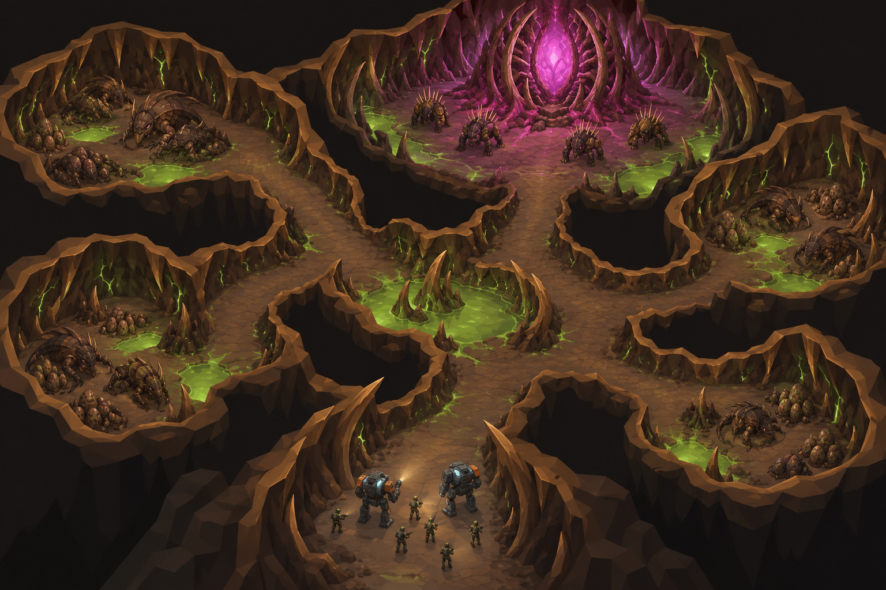

# Concept: Hive cavern



- **Status:** accepted on the first attempt.
- **Generator:** Codex CLI 0.157.1 (`codex exec`), built-in `image_gen` through its imagegen skill; image model as served by the tool, via `tools/art/gen-image.sh`.
- **Date:** 2026-09-26
- **Asset:** `hive-cavern.png`, 1536×1024, unmodified tool output. Documentation only, not a runtime asset.
- **Prompt file:** [`prompts/hive-cavern.txt`](prompts/hive-cavern.txt): the exact text passed to the generator, plus the standard save-path suffix the script appends.
- **Modeller brief:** [campaign bestiary](../../kits/campaign-bestiary.md#hive-cavern)
- **Campaign arc:** §6.5 Hive Assault, §7.5 hive caverns (D4)

## Prompt

```
Key-art environment concept for Terra Under Threat, a near-future Earth turn-based tactics game: an underground alien hive cavern seen as a cut-away isometric diorama from 35 degrees above, orthographic like a tactical game map. A huge organic cave system of several large rounded chambers linked by wide tunnels, every tunnel at least as wide as two walking war mechs side by side. There is no ceiling: the walls are cut away along the top so every chamber floor is visible from above. Walls of dark umber rock #2E2118 fused with walnut #5C3B25 and chestnut #8B5D36 chitin ribs and buttresses with toasted-tan #B88B58 rims; floors of russet resin-crusted flesh #73452E and dark rock with glowing green-dim #4C8F1A pools. In the side chambers, clusters of dormant brown bugs sleep curled up in shell cradles and egg beds. In the deepest chamber at the far end stands the hive core, a huge rib-caged pulsing organ glowing magenta #E23DFF, guarded by squat armoured spine-throwing bugs with quills on their backs. At the near entrance, for scale, two TDF war mechs (cool grey #5B6573 armour, small orange #F08A24 markings, pale blue #7FD1FF cockpit glow, each about 5 metres tall) and a small squad of olive #6B7A3F uniformed soldiers advance with lights. Small bright green #9CFF3D vein lines on the walls. Dim, moody but readable light from the glowing pools; brown and dark umber dominate. Crisp stylized low-poly game environment art: large faceted planes, hard edges, flat shading, clean vector-like fills, readable tile-scale shapes a player could navigate. Not photoreal and not painterly. No text, no labels, no UI, no watermark, no logos, no borders. Wide landscape 3:2 image.
```

## Keep

- A cut-away view with no ceiling: rounded chambers joined by wide tunnels, rib-lined walls standing as cliffs.
- Dormant clusters curled in the side chambers; spine-throwers ringing the core at the far end; the squad entering at the mouth for scale.

## Change in the map art

- The glowing green pools are a wash. In the game, floor pools are non-emissive `bug-bio-green-dim`, and green emissive is only thin vein lines.
- The perspective is steeper and more painterly than the orthographic tactical camera: take the layout and materials from it, not the lighting.
