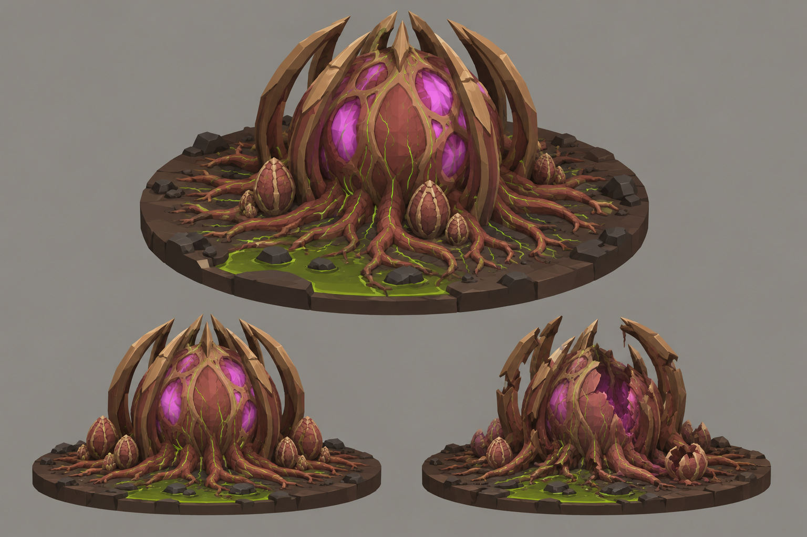

# Concept: Hive core



- **Status:** accepted on the first attempt.
- **Generator:** Codex CLI 0.157.1 (`codex exec`), built-in `image_gen` through its imagegen skill; image model as served by the tool, via `tools/art/gen-image.sh`.
- **Date:** 2026-09-26
- **Asset:** `hive-core.png`, 1536×1024, unmodified tool output. Documentation only, not a runtime asset.
- **Prompt file:** [`prompts/hive-core.txt`](prompts/hive-core.txt): the exact text passed to the generator, plus the standard save-path suffix the script appends.
- **Modeller brief:** [campaign bestiary](../../kits/campaign-bestiary.md#hive-core)
- **Campaign arc:** §6.5 Hive Assault, §7.5 hive caverns

## Prompt

```
Scene/backdrop: a seamless, evenly lit, light neutral grey #8E8A82 studio backdrop, the same light grey in every corner and behind every view, like a clean product sheet.

Concept sheet for a hive core mission objective from Terra Under Threat, a near-future Earth turn-based tactics game played from an isometric camera: the living heart of an alien hive, standing in the deepest chamber of an underground cavern, which soldiers and war mechs must destroy. A huge pulsing organ about 5 metres tall on a square footprint 6 metres across: a massive bulbous heart-like mass of russet flesh #73452E and light membrane #956344, caged by tall curved ribs of walnut #5C3B25 and chestnut #8B5D36 chitin with toasted-tan #B88B58 rims that rise from the floor and arch over it like a crown. Through gaps in the membrane, glowing magenta #E23DFF chambers pulse; thin bright green #9CFF3D vein lines run over the surface and down into thick root-like arteries that spread out across the floor in every direction. A few ribbed eggs cluster around its base. It must read as one big, obviously destructible target. It stands on a round cut-away diorama disc of dark cavern floor about 9 metres across: dark umber resin-crusted rock #2E2118, a glowing green-dim #4C8F1A pool, the disc edge cut clean. Crisp stylized low-poly game model style: large faceted planes, hard edges, flat shading, clean vector-like fills with no noise, grain or painterly texture, matte materials. Not photoreal and not a glossy 3D render. Bioluminescent spots are small, crisp and few. Background: a flat, evenly and brightly lit mid-grey #8E8A82 studio backdrop around the diorama, exactly the same light grey at every edge and corner, like a product shot on grey card. No other scenery. No text, no labels, no captions, no watermark, no logos, no borders or panels. Wide landscape 3:2 concept sheet, all views at the same scale: one large isometric three-quarter view from 35 degrees above filling the top two-thirds; below it a side view; and a smaller view of the same core badly damaged, ribs cracked, membrane torn open and its glow dimmed.

Avoid: dark or black background, vignette, spotlight, coloured glow around the silhouette, dramatic rim lighting, text, labels, watermark. Keep the Scene/backdrop line when you write the image prompt.
```

## Keep

- A russet heart mass in a crown of tall ribs, magenta windows, thin green veins, root arteries spreading out, ribbed eggs at the base.
- The damaged state: ribs broken, membrane torn, glow dimmed.

## Change on the model

- Author at 3×3. The arteries beyond the footprint become floor props or decals from the cavern kit.
- The damaged state is a second GLB (`bug.hive-core-damaged`) swapped in below half HP, or the destroyed wreck.
