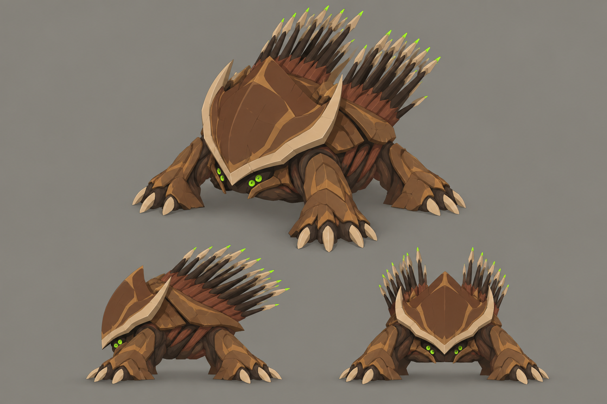

# Concept: Hive Guard



- **Status:** accepted on the first attempt.
- **Generator:** Codex CLI 0.157.1 (`codex exec`), built-in `image_gen` through its imagegen skill; image model as served by the tool, via `tools/art/gen-image.sh`.
- **Date:** 2026-09-26
- **Asset:** `hive-guard.png`, 1536×1024, unmodified tool output. Documentation only, not a runtime asset.
- **Prompt file:** [`prompts/hive-guard.txt`](prompts/hive-guard.txt): the exact text passed to the generator, plus the standard save-path suffix the script appends.
- **Modeller brief:** [campaign bestiary](../../kits/campaign-bestiary.md#hive-guard)
- **Campaign arc:** §8 bestiary (Act II, placed in hives), §6.5 Hive Assault, §7.5

## Prompt

```
Concept sheet for a new alien bug species called the hive guard, from Terra Under Threat, a near-future Earth turn-based tactics game played from an isometric camera. The hive guard is a stationary living turret: it never leaves its hive chamber and throws spines at range. Body plan: squat, heavy and rooted, about 2 metres wide and 2.6 metres tall to the tips of its spines. Its front is a broad curved shield plate of chestnut chitin with a thick pale horn rim, protecting a low sunken head whose two paired green #9CFF3D eye clusters peer out from beneath the shield. Instead of walking legs, four thick root-like limbs splay outward and dig into the ground like tree buttresses, ending in claws buried in the floor, so it is clearly anchored in place. On its high domed back a raised quiver-like hump carries two fanned rows of long straight spines swept up and back like porcupine quills, each spine a dark umber shaft with a pale horn point and a small bright green #9CFF3D glowing tip, ready to be launched; russet launching muscles bunch at the base of each row. Its whole shape reads as a fortress: wide at the base, armoured in front, bristling on top. It belongs to the same creature family as the game's existing bugs, the swarmer (a low insect under a thin crescent-shaped shield hood), the lurker (a thin mantis-like stalker with long sickles) and the brute (a broad beetle with paired oval wing cases and cleavers): the same brown chitin, dark umber joints, tan markings, paired eye clusters and pale horn blade edges, but its own distinct body plan. Colours, hexes exact: walnut-brown primary shell #5C3B25, chestnut overlapping plates and limb armour #8B5D36, dark umber joints, undersides and blade backs #2E2118, broad toasted-tan markings and shell lips #B88B58, sandy shell highlights #C6A275, russet tissue between plates #73452E, pale horn cutting edges, spines and toe tips #DDC39B. No purple, violet or blue on the creature. Crisp stylized low-poly game model style: large faceted planes, hard edges, flat shading, clean vector-like fills with no noise, grain or painterly texture, matte organic chitin. Not photoreal and not a glossy 3D render. Bioluminescence is small and bright, never a wash. Background: one uniform flat mid-grey #8E8A82 from edge to edge, like a studio card: no vignette, no gradient, no dark corners, no glow or halo around the subject, only a soft grey contact shadow under each view; no scenery, no ground plane, no props. No text, no labels, no captions, no watermark, no logos, no borders or panels. Wide landscape 3:2 concept sheet of the same single design, all views at the same scale: one large isometric three-quarter view from 35 degrees above filling the top two-thirds, and below it a clean side-profile view and a smaller front view, evenly spaced.
```

## Keep

- Broad chestnut front shield with a thick pale horn rim and the green eye clusters peering out beneath it.
- Two fanned racks of long dark spines with pale points and small green tips: the back reads as a porcupine from every yaw.
- Wide, low, triangular fortress silhouette on four splayed root limbs with buried claws.

## Change on the model

- The middle view is closer to a three-quarter front than a true side profile; take the side from the large view.
- The limbs still read a little like walking legs. Bury the claws in a resin collar at the ground so it is plainly immobile.
- Keep the russet launching muscle at the spine bases to a thin band; it must not become a flesh stripe.
