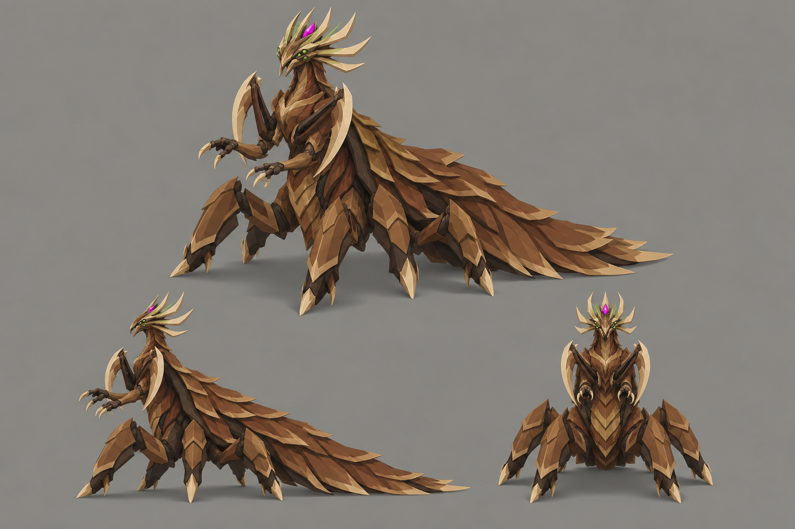

# Concept: Sovereign



- **Status:** accepted on attempt 2 (regenerated 1×; rejected attempts are not committed, see below).
- **Generator:** Codex CLI 0.157.1 (`codex exec`), built-in `image_gen` through its imagegen skill; image model as served by the tool, via `tools/art/gen-image.sh`.
- **Date:** 2026-09-26
- **Asset:** `sovereign.png`, 1536×1024, unmodified tool output. Documentation only, not a runtime asset.
- **Prompt file:** [`prompts/sovereign.txt`](prompts/sovereign.txt): the exact text passed to the generator, plus the standard save-path suffix the script appends.
- **Modeller brief:** [campaign bestiary](../../kits/campaign-bestiary.md#sovereign)
- **Campaign arc:** §8 bestiary (finale), §6.9 Spore Platform, §9 smart enemies

## Prompt

```
Scene/backdrop: a seamless, evenly lit, light neutral grey #8E8A82 studio backdrop, the same light grey in every corner and behind every view, like a clean product sheet.

Concept sheet for the final boss alien bug called the sovereign, the apex ruler of the swarm, from Terra Under Threat, a near-future Earth turn-based tactics game played from an isometric camera. It is the largest bug in the game: about 7 metres tall, taller than a war mech, on a square footprint 8 metres across. Body plan: regal and commanding, with a centaur-like upright stance. A massive armoured six-legged lower body is planted wide, and rising from its front is an upright armoured torso with a long neck and a proud head held high. Behind the head a tall crown of swept pale horn blades fans out like a crown of blades, with a small bright magenta #E23DFF core glowing at its centre. A long mantle of overlapping chestnut and walnut plates edged in toasted tan drapes down its back to the ground like a royal train. Two enormous scythe arms with pale horn edges are folded ceremonially across the torso, and two smaller clawed hands reach forward in a commanding gesture. Paired green #9CFF3D eye clusters and a few thin green vein lines along the crown. It stands like a monarch, calm and upright, not crouched. It belongs to the same creature family as the game's existing bugs, the swarmer (a low insect under a thin crescent-shaped shield hood), the lurker (a thin mantis-like stalker with long sickles) and the brute (a broad beetle with paired oval wing cases and cleavers): the same brown chitin, dark umber joints, tan markings, paired eye clusters and pale horn blade edges, but its own distinct body plan. Colours, hexes exact: walnut-brown primary shell #5C3B25, chestnut overlapping plates and limb armour #8B5D36, dark umber joints, undersides and blade backs #2E2118, broad toasted-tan markings and shell lips #B88B58, sandy shell highlights #C6A275, russet tissue between plates #73452E, pale horn cutting edges, spines and toe tips #DDC39B. No purple, violet or blue on the creature. Crisp stylized low-poly game model style: large faceted planes, hard edges, flat shading, clean vector-like fills with no noise, grain or painterly texture, matte organic chitin. Not photoreal and not a glossy 3D render. Bioluminescent spots are small, crisp and few. Background: a flat, evenly and brightly lit mid-grey #8E8A82 studio backdrop, exactly the same light grey at every edge and corner, like a product shot on grey card; the only shading on it is a small soft grey contact shadow under each view. No scenery, no ground plane, no props. No text, no labels, no captions, no watermark, no logos, no borders or panels. Wide landscape 3:2 concept sheet of the same single design, all views at the same scale: one large isometric three-quarter view from 35 degrees above filling the top two-thirds, and below it a clean side-profile view and a smaller front view, evenly spaced.

Avoid: dark or black background, vignette, spotlight, coloured glow around the silhouette, dramatic rim lighting, text, labels, watermark. Keep the Scene/backdrop line when you write the image prompt.
```

## Keep

- Centaur stance: six planted armoured legs under an upright torso with a long neck and raised head.
- Fan crown of swept pale horn blades with a magenta gem at its centre: the identifying read from above.
- Long mantle of overlapping plates draped to the ground like a train; two scythes folded across the chest; two small clawed hands held forward; green eye clusters.

## Change on the model

- The train makes the body about twice as long as it is wide. Curl or shorten it so the whole creature fits a 4×4 footprint.
- Make the crown larger than on the sheet: from the tactical camera the crown and the scythes are what identify it.
- The mantle is tan-heavy. Bring walnut and chestnut into the plates so tan stays a rim and marking colour.

## Attempts

- **v1:** rejected: the backdrop came out as a dark vignette with a warm glow halo round the creature instead of flat grey (the prompt then said the crown fanned out "like a halo"). v2 adds a leading `Scene/backdrop:` line and a closing `Avoid:` line in the format the imagegen skill writes its own prompts in, and drops the word halo.
- **v2:** accepted (this image).
