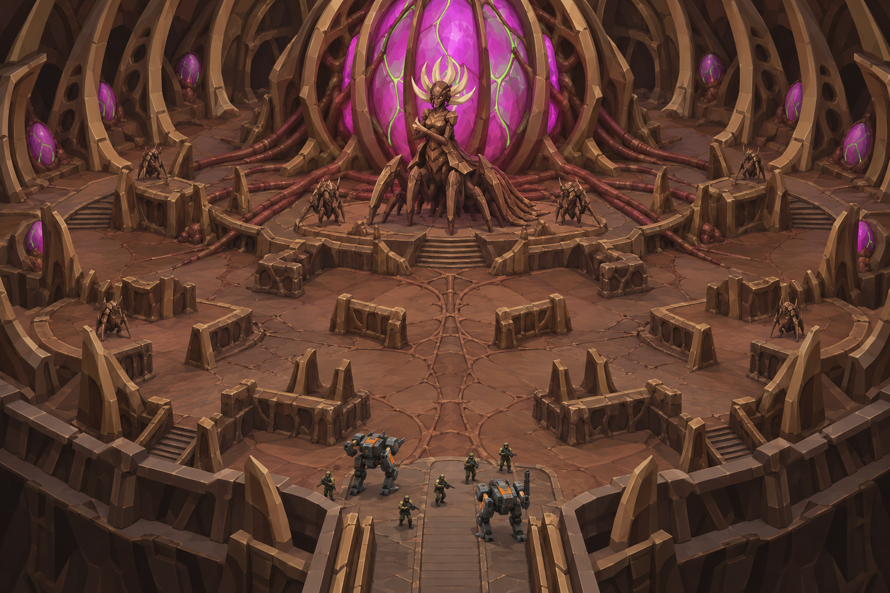

# Concept: Spore platform, stage 2: core chamber



- **Status:** accepted on attempt 2 (regenerated 1×; rejected attempts are not committed, see below).
- **Generator:** Codex CLI 0.157.1 (`codex exec`), built-in `image_gen` through its imagegen skill; image model as served by the tool, via `tools/art/gen-image.sh`.
- **Date:** 2026-09-26
- **Asset:** `spore-platform-core.png`, 1536×1024, unmodified tool output. Documentation only, not a runtime asset.
- **Prompt file:** [`prompts/spore-platform-core.txt`](prompts/spore-platform-core.txt): the exact text passed to the generator, plus the standard save-path suffix the script appends.
- **Modeller brief:** [campaign bestiary](../../kits/campaign-bestiary.md#spore-platform)
- **Campaign arc:** §6.9 Spore Platform, §7 platform archetype

## Prompt

```
Key-art environment concept for Terra Under Threat, a near-future Earth turn-based tactics game: stage 2 of the final mission, the core chamber deep inside the alien spore platform. Cut-away isometric diorama view from 35 degrees above, orthographic like a tactical game map, with no ceiling; the near walls are cut away low so the whole chamber floor is visible and nothing tall blocks the foreground. A vast round chamber: walls of towering chitin ribs of walnut #5C3B25 and chestnut #8B5D36 with toasted-tan #B88B58 rims curving inward, floors of fused plates and russet flesh #73452E, and raised terraces and spine buttresses as cover. In the centre is the platform's core: a colossal glowing seed-engine organ bigger than a building, held in a cage of chitin ribs, pulsing bright magenta #E23DFF with green #9CFF3D veins, thick brown arteries radiating out across the floor. In front of the core, on a raised dais, stands the sovereign, the swarm's regal final boss: a towering centaur-like brown bug with a six-legged armoured lower body with an upright armoured torso, a tall crown of swept pale horn #DDC39B blades fanning out behind its head like a halo, a long mantle of overlapping plates draped down its back like a royal train, and huge scythe arms folded across its chest; it is taller than a war mech. Smaller brown guard bugs flank it. At the chamber entrance, a small TDF team of cool grey #5B6573 war mechs with orange #F08A24 markings and olive #6B7A3F uniformed soldiers advances. Crisp stylized low-poly game environment art: large faceted planes, hard edges, flat shading, clean vector-like fills, readable tile-scale shapes a player could navigate. Not photoreal and not painterly. No text, no labels, no UI, no watermark, no logos, no borders. Wide landscape 3:2 image. Colour discipline: walnut brown, chestnut and dark umber dominate the whole scene and the floor and walls stay brown under neutral light; the magenta glow is confined to the core organ itself and a few small egg-lights, and green is only thin vein lines. The chamber is not bathed in purple or pink light.
```

## Keep

- A round chamber of terraces, stairs and low rib walls as cover, with a narrow entrance causeway for the squad.
- The core as a giant rib-caged magenta seed behind a dais; egg pods in the wall niches; guards flanking the dais.

## Change in the map art

- The Sovereign here is drawn more humanoid than on its own sheet. Model it from [sovereign](sovereign.md).
- Keep magenta on the core and the pods; floors and walls stay brown under neutral light.

## Attempts

- **v1:** rejected: magenta light washed the whole chamber, so the floor and walls read pink rather than brown, and tall foreground walls framed the view like a vignette. v2 adds a colour-discipline sentence and asks for the near walls to be cut away low.
- **v2:** accepted (this image).
