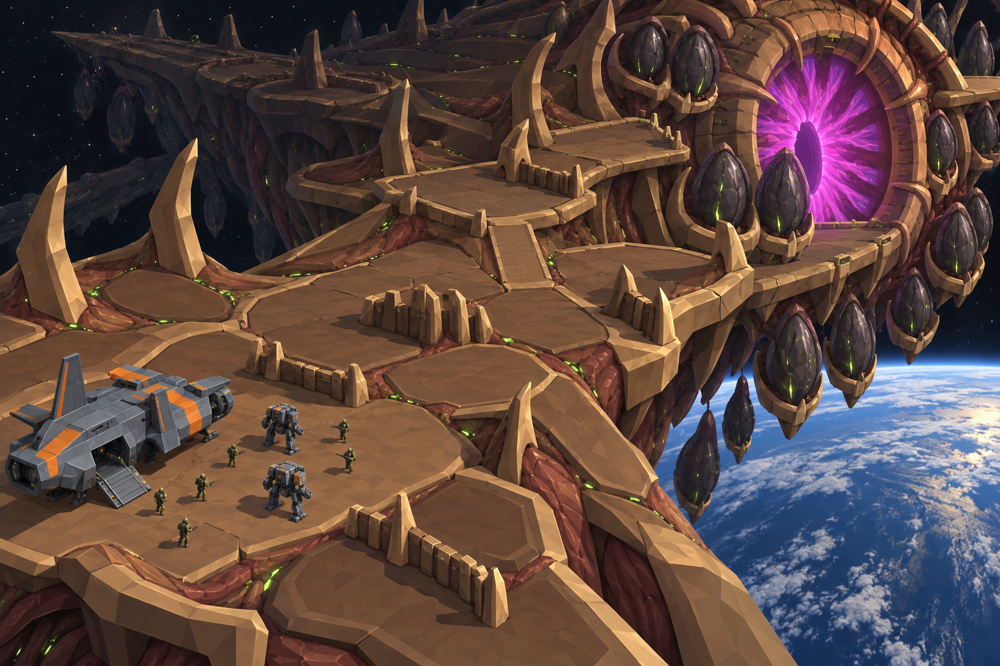

# Concept: Spore platform, stage 1: hull and docking ring



- **Status:** accepted on the first attempt.
- **Generator:** Codex CLI 0.157.1 (`codex exec`), built-in `image_gen` through its imagegen skill; image model as served by the tool, via `tools/art/gen-image.sh`.
- **Date:** 2026-09-26
- **Asset:** `spore-platform-hull.png`, 1536×1024, unmodified tool output. Documentation only, not a runtime asset.
- **Prompt file:** [`prompts/spore-platform-hull.txt`](prompts/spore-platform-hull.txt): the exact text passed to the generator, plus the standard save-path suffix the script appends.
- **Modeller brief:** [campaign bestiary](../../kits/campaign-bestiary.md#spore-platform)
- **Campaign arc:** §6.9 Spore Platform, §7 platform archetype

## Prompt

```
Key-art environment concept for Terra Under Threat, a near-future Earth turn-based tactics game: stage 1 of the final mission, the outer hull and docking ring of the alien spore platform, a colossal organic ship hanging in orbit above Earth. Isometric diorama view from 35 degrees above, orthographic like a tactical game map. The walkable battlefield is the platform's upper hull: broad overlapping plates of walnut #5C3B25 and chestnut #8B5D36 chitin forming flat terraces and ramps, toasted-tan #B88B58 plate rims, curved ridges and spine buttresses that serve as cover, and russet flesh #73452E in the seams, with small green #9CFF3D vein lights along the plate seams. A huge organic docking ring dominates one side of the scene: a ring-shaped collar of ribbed chitin arching around a glowing magenta #E23DFF iris-like opening, with dark seed-shaped spore pods clustered in ribbed cradles around it, ready to drop to Earth. A TDF drop ship in cool grey #5B6573 with orange #F08A24 markings has landed on a flat plate near the edge, and a small squad of grey war mechs and olive #6B7A3F uniformed soldiers deploys from it. Background: black space with sparse stars, the curved blue-and-white limb of Earth far below, and the rest of the platform's dark organic silhouette receding into the distance. Crisp stylized low-poly game environment art: large faceted planes, hard edges, flat shading, clean vector-like fills, readable tile-scale shapes a player could navigate. Not photoreal and not painterly. No text, no labels, no UI, no watermark, no logos, no borders. Wide landscape 3:2 image.
```

## Keep

- Terraced hull plates as walkable ground, with spine buttresses and low rib walls as cover and green vein light in the seams.
- The docking ring: a ribbed collar round a magenta iris, with pods cradled all round it.
- Earth's limb below and black space above: the one map in the game with no ground under the edge.

## Change in the map art

- The plates are tan-dominant. In the game they are walnut and chestnut, with tan only on rims.
- The view is more perspective than the orthographic game camera; use it for layout and material only.
