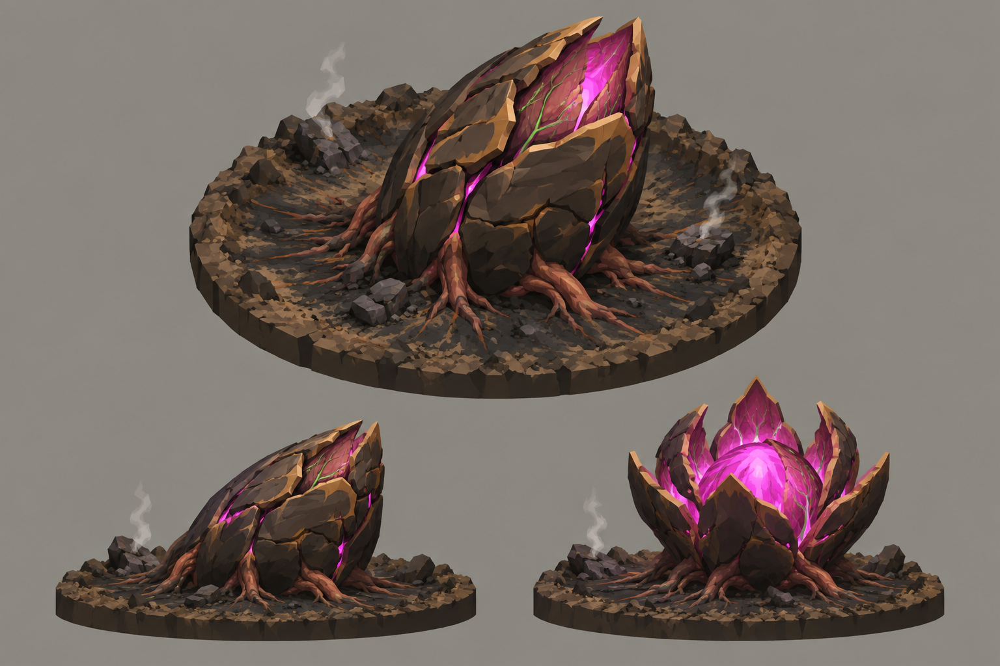

# Concept: Spore pod



- **Status:** accepted on the first attempt.
- **Generator:** Codex CLI 0.157.1 (`codex exec`), built-in `image_gen` through its imagegen skill; image model as served by the tool, via `tools/art/gen-image.sh`.
- **Date:** 2026-09-26
- **Asset:** `spore-pod.png`, 1536×1024, unmodified tool output. Documentation only, not a runtime asset.
- **Prompt file:** [`prompts/spore-pod.txt`](prompts/spore-pod.txt): the exact text passed to the generator, plus the standard save-path suffix the script appends.
- **Modeller brief:** [campaign bestiary](../../kits/campaign-bestiary.md#spore-pod)
- **Campaign arc:** §6.3 Crash Site, §6.9 First Skyfall and Intact Pod, §7 crater archetype

## Prompt

```
Concept sheet for a crash-site mission objective, a spore pod, from Terra Under Threat, a near-future Earth turn-based tactics game played from an isometric camera. The spore pod is an alien organic seed-meteor that fell from orbit and half buried itself in open ground; it must be destroyed before it matures and hatches. The pod is about 3 metres across and 2.5 metres tall: a fat teardrop seed shape tilted at an angle with its leading end buried in the earth. Its outer shell is a thick heat-scorched husk of charred dark umber #2E2118 and walnut #5C3B25 chitin plates, cracked and flaking like burnt bark, with toasted-tan #B88B58 rims on the larger plates. Through long glowing seams and a split opening near the top, the living interior shows: russet flesh #73452E, light membrane #956344 and bright magenta #E23DFF egg-light, with small green #9CFF3D vein lines. Thick fleshy root tendrils have pushed out of the pod into the soil. It sits in its own small scorched impact crater, shown as a clean round cut-away diorama disc about 5 metres across: a shallow bowl of scorched black-brown earth with radial scorch streaks, a raised rim of broken clods and two or three small smoking debris chunks. Crisp stylized low-poly game model style: large faceted planes, hard edges, flat shading, clean vector-like fills with no noise, grain or painterly texture, matte materials. Not photoreal and not a glossy 3D render. Bioluminescent spots are small, crisp and few. Background: a flat, evenly and brightly lit mid-grey #8E8A82 studio backdrop around the diorama, exactly the same light grey at every edge and corner, like a product shot on grey card. No other scenery. No text, no labels, no captions, no watermark, no logos, no borders or panels. Wide landscape 3:2 concept sheet, all views at the same scale: one large isometric three-quarter view from 35 degrees above filling the top two-thirds; below it a side view of the pod and crater; and a smaller third view of the same pod about to mature, its shell split wide open into petals and its interior glowing much brighter.
```

## Keep

- A tilted teardrop husk of charred, cracked plates with tan rims, buried nose first, glowing magenta through its seams and a split crown.
- Fleshy root tendrils pushing out into the soil.
- The mature state (petals split wide, core glowing): the turn-8 warning when the deadline is close.

## Change on the model

- The crater disc is map terrain from the crater archetype, not part of the model. The GLB carries the pod, its roots and a small scorch skirt inside 2×2.
- Smoke is VFX, not geometry.
