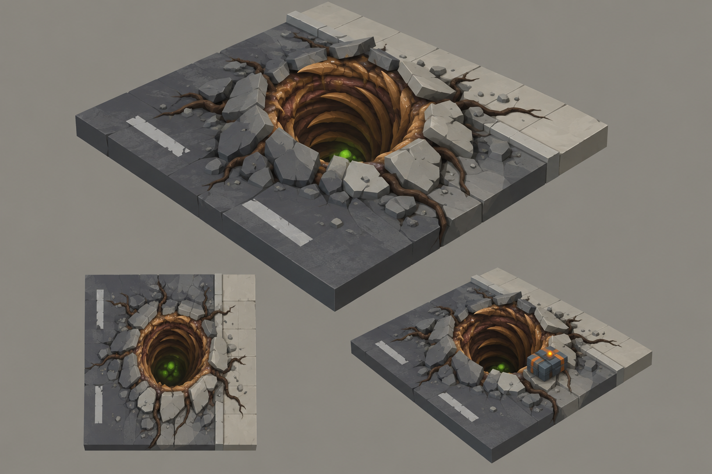

# Concept: Tunnel mouth



- **Status:** accepted on the first attempt.
- **Generator:** Codex CLI 0.157.1 (`codex exec`), built-in `image_gen` through its imagegen skill; image model as served by the tool, via `tools/art/gen-image.sh`.
- **Date:** 2026-09-26
- **Asset:** `tunnel-mouth.png`, 1536×1024, unmodified tool output. Documentation only, not a runtime asset.
- **Prompt file:** [`prompts/tunnel-mouth.txt`](prompts/tunnel-mouth.txt): the exact text passed to the generator, plus the standard save-path suffix the script appends.
- **Modeller brief:** [campaign bestiary](../../kits/campaign-bestiary.md#tunnel-mouth)
- **Campaign arc:** §6.7 Tunnel Sabotage, §7 settlement + tunnel mouths

## Prompt

```
Scene/backdrop: a seamless, evenly lit, light neutral grey #8E8A82 studio backdrop, the same light grey in every corner and behind every view, like a clean product sheet.

Concept sheet for a tunnel mouth mission objective from Terra Under Threat, a near-future Earth turn-based tactics game played from an isometric camera: an alien burrow that has broken up through a city street, where soldiers must plant demolition charges. Shown as a clean-edged square cut-away diorama tile 4 metres on a side: dark asphalt road #3A3D42 on one half and pale concrete sidewalk #A7A297 with a kerb on the other. In the centre the pavement is heaved upward and cracked outward in a ring of broken slabs tilted up at sharp angles around a round dark hole about 2.5 metres wide. The hole's throat is lined with ribbed rings of walnut #5C3B25 and chestnut #8B5D36 chitin that spiral down into darkness, russet flesh #73452E between the ribs, toasted-tan #B88B58 rims on the outermost ribs, glistening resin at the lip and a small green #9CFF3D glow deep inside. A few root-like dark umber #2E2118 tendrils crawl outward across the pavement cracks. Crisp stylized low-poly game model style: large faceted planes, hard edges, flat shading, clean vector-like fills with no noise, grain or painterly texture, matte materials. Not photoreal and not a glossy 3D render. Bioluminescent spots are small, crisp and few. Background: a flat, evenly and brightly lit mid-grey #8E8A82 studio backdrop around the diorama, exactly the same light grey at every edge and corner, like a product shot on grey card. No other scenery. No text, no labels, no captions, no watermark, no logos, no borders or panels. Wide landscape 3:2 concept sheet, all views at the same scale: one large isometric three-quarter view from 35 degrees above filling the top two-thirds; below it a straight top-down view; and a smaller third view of the same tunnel mouth with a TDF demolition charge planted on its rim, a compact cool grey #5B6573 box with an orange #F08A24 hazard stripe and a small orange light.

Avoid: dark or black background, vignette, spotlight, coloured glow around the silhouette, dramatic rim lighting, text, labels, watermark. Keep the Scene/backdrop line when you write the image prompt.
```

## Keep

- A ring of heaved, broken pavement slabs round a dark hole; a throat of ribbed chitin spiralling down; a green glow deep inside; root tendrils across the cracks.
- The charged state: a compact grey charge with an orange hazard stripe and an orange light on the rim.

## Change on the model

- The asphalt and sidewalk are map tiles. The model is the heaved rim and the throat, set into a 2×2 hole.
- Model the throat with an inner wall and a closed dark lining, as the infestation kit does for every opening; never a black decal.
- The charge is a separate small prop mounted on `socket_charge`.
