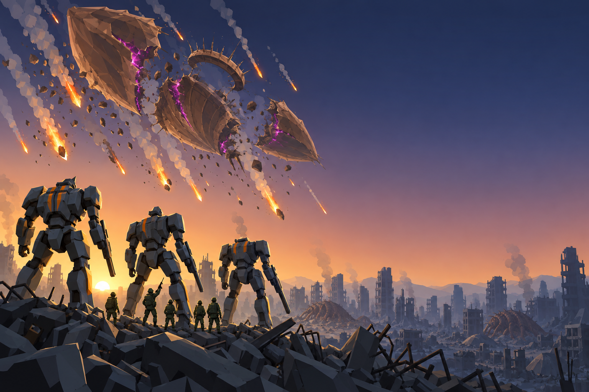

# Concept: Victory backdrop



- **Status:** accepted on the first attempt.
- **Generator:** Codex CLI 0.157.1 (`codex exec`), built-in `image_gen` through its imagegen skill; image model as served by the tool, via `tools/art/gen-image.sh`.
- **Date:** 2026-09-26
- **Asset:** `victory-backdrop.png`, 1536×1024, unmodified tool output (the source, kept here as documentation).
- **Runtime asset:** `public/assets/ui/backdrops/victory.webp`, the same 1536×1024 image as WebP at quality 78 (105 KB), made with `magick victory-backdrop.png -strip -quality 78 victory.webp` (ImageMagick 7.1.1-43). The end screen shows it full-bleed behind a platform victory (`VICTORY_ART` in `src/ui/service/outcome-copy.ts`).
- **Prompt file:** [`prompts/victory-backdrop.txt`](prompts/victory-backdrop.txt): the exact text passed to the generator, plus the standard save-path suffix the script appends.
- **Campaign arc:** D1 (the platform ends the campaign), D7 (Last Hope), §13 (the victory screen)
- **Renders:** [`victory-screen.png`](../../victory-screen.png), [`victory-screen-last-hope.png`](../../victory-screen-last-hope.png)

## Prompt

```
Scene/backdrop: dawn over a wrecked city, seen from street level on a rubble ridge, a clear wide sky taking the upper two-thirds of the frame.

Key-art victory backdrop for Terra Under Threat, a near-future Earth turn-based tactics game: the moment the war is won. Wide landscape 3:2 image, a low heroic camera looking up past the foreground towards the sky. Sky: a clear dawn, deep indigo #1B2238 at the top fading through dusty rose to warm amber #F0A04B and pale gold at the horizon on the left, where the sun is just rising behind the ruins. High in the upper-left sky hangs the alien spore platform, a colossal organic ship of walnut #5C3B25 and chestnut #8B5D36 chitin plates with toasted-tan #B88B58 rims, spines and a ring-shaped docking collar, now breaking apart: it has split into three or four huge pieces drifting away from each other, its dying magenta #E23DFF core light guttering only inside the cracks, and dozens of burning fragments streak down through the atmosphere as long bright orange #F08A24 fire trails with pale grey smoke, like a meteor shower. Middle ground: the skyline of a ruined city, broken towers with exposed floors and collapsed concrete blocks in cool blue-grey shadow, a few thin smoke columns rising, and the dead brown husks of alien egg mounds slumped among the rubble. Foreground, lower left: three TDF war mechs stand on a ridge of rubble seen from behind and three-quarter, looking up at the burning platform: tall bipedal walkers with shoulders wider than hips and clearly separate legs, cool grey #5B6573 armour plates with orange #F08A24 stripes, one arm ending in a long weapon, dented and scorched but standing, rim-lit warm gold by the dawn. Five small olive #6B7A3F uniformed soldiers in helmets stand beside them, one raising a rifle overhead. Composition: the platform, the sun and the mechs sit in the left 60% of the frame; the right third of the image is calm open dawn sky above low distant ruins in soft shadow with no important detail and no bright spots, because an interface panel will cover it. Horizon about one third up from the bottom. Crisp stylized low-poly game key art: large faceted planes, hard edges, flat shading, clean vector-like fills with no noise or grain, matching a stylized isometric tactics game. Not photoreal and not painterly. No text, no labels, no captions, no UI, no watermark, no logos, no borders or panels.

Avoid: text, letters, logos, watermark, frames, borders, heavy vignette, a sky bathed in purple or pink light, magenta light spilling over the city, mechs facing the camera, gore. Keep the Scene/backdrop line when you write the image prompt.
```

## Keep

- The platform in the upper left, broken into four pieces round its docking ring, the magenta confined to the cracks and the fragments falling as orange fire trails.
- Dawn: indigo overhead, amber and gold at the horizon behind the ruins; the sun low on the left.
- Three grey mechs with orange stripes on the rubble ridge seen from behind, with the olive squad beside them, one soldier raising a rifle.
- The right third is quiet: open sky over low ruins, so the end screen's panel covers nothing that matters.

## Change if regenerated

- Slumped egg mounds in the city read as live bugs at a glance. They are husks; a later pass could flatten them further or drop them.
- The mechs are generic walkers, not the game's chassis. The art is mood, not a model reference: take the mechs from [`mech.md`](../mech.md).

## Attempts

- **v1:** accepted (this image). Viewed before acceptance: platform upper left, magenta only inside the cracks, dawn sky, mechs seen from behind, right third quiet, no text or watermark.
