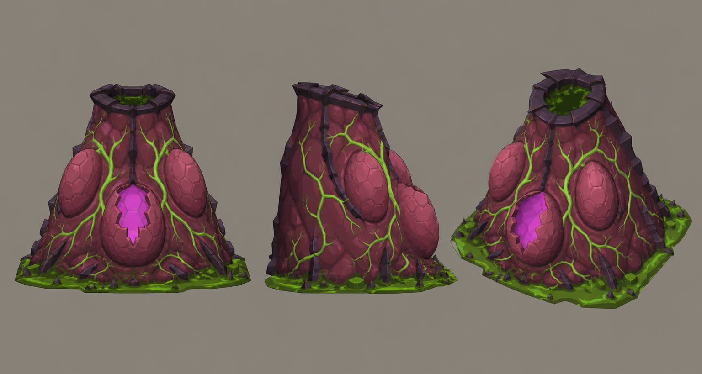

# Concept: Egg spawner



- **Generator**: Codex CLI 0.152.1 built-in `image_gen` (model gpt-5.6-sol session; image model as served by the tool), via `tools/art/gen-image.sh`.
- **Date**: 2026-09-02
- **Prompt file**: [`prompts/egg-spawner.txt`](prompts/egg-spawner.txt) (exact text passed to the generator, plus the standard save-path suffix the script appends)
- **Style guide refs**: §3 scale/silhouette, §4 palette

## Prompt

```
Concept sheet for an alien egg spawner, a static objective from a near-future Earth turn-based tactics game. A fleshy, pulsing organic mound about 2.8 metres tall on a 2 metre square footprint, four large ovoid eggs half-sunk into it with one egg split open, thick veins across the surface, and a wet hatch opening at the top. Unsettling and wrong, but not gory. Colours: mound flesh #7A3A4E with highlights #B05A6E, egg membranes #B05A6E, glowing egg interiors bioluminescent magenta #E23DFF, glowing vein lines bioluminescent green #9CFF3D, a sick green residue pool #4C8F1A around the base, dark chitin ridges #2B2436. Low-poly game model style, flat shading, hard edges, clean vector-like fills with no gradients or noise, plain neutral grey background #8E8A82, no text, no labels, no watermark, no logos. Wide landscape concept sheet showing the same design three times side by side: front view, side view, and isometric three-quarter view from 35 degrees above.
```

## Keep

- Fleshy cone with four eggs, one split open showing magenta interior, thick green veins, dark chitin hatch ring at the top, sick green residue pool at the base. Unsettling without gore. The pulsing veins are a good target for an emissive animation later.

## Change next pass

- Concept is taller and more conical than the 1.4 u placeholder mound; the production model should split the difference (about 1.6 u) so it still reads under a 1.5 u floor.
- Hatch opening needs to be an obvious VFX socket for the egg-burst sprite.
