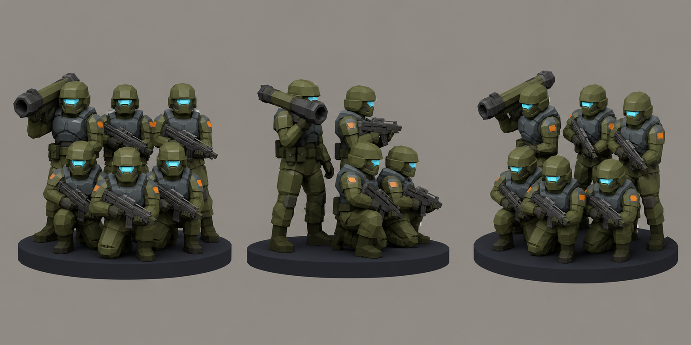

# Concept: TDF infantry squad token



- **Generator**: Codex CLI 0.152.1 built-in `image_gen` (model gpt-5.6-sol session; image model as served by the tool), via `tools/art/gen-image.sh`.
- **Date**: 2026-09-02
- **Prompt file**: [`prompts/infantry-squad.txt`](prompts/infantry-squad.txt) (exact text passed to the generator, plus the standard save-path suffix the script appends)
- **Style guide refs**: §3 scale/silhouette, §4 palette

## Prompt

```
Concept sheet for a TDF infantry squad token from a near-future Earth turn-based tactics game. Exactly five small soldiers stand together on one thin round dark base disc: two soldiers kneeling in the front row, three standing in the back row, arranged as a tight wedge with the leader front centre. Count carefully: five helmets, five rifles or launchers, one base disc. Practical military kit: big helmets with small cyan visors, body armour, rifles held ready; the back-left soldier carries a long rocket launcher over the shoulder. Uniforms olive #6B7A3F with dark olive #45502A webbing and boots, armour plates cool grey #5B6573, tiny orange #F08A24 shoulder markings, visors #7FD1FF, base disc dark grey #2E3440. Chunky readable proportions, oversized helmets, no facial detail. Low-poly game model style, flat shading, hard edges, clean vector-like fills with no gradients or noise, plain neutral grey background #8E8A82, no text, no labels, no watermark, no logos. Wide landscape concept sheet showing the same five-soldier group three times side by side: front view, side view, and isometric three-quarter view from 35 degrees above.
```

## Keep

- Second pass. Kneeling front rank, standing rear rank, rocket carrier on the flank: this is the squad-token composition. Big helmets, cyan visors, orange shoulder patch, olive uniform with grey chest plate, one dark base disc. Chunky proportions survive downscaling.

## Change next pass

- The generator drew six figures even when told "exactly five"; the token is five and the placeholder GLB builds five. Treat the sixth as an extra reference pose, or crop.
- Base disc should be thinner (0.05 u); rear-rank figures could stand a little further back so the wedge reads from above.
- First pass (three to four figures) is kept in git history only.
