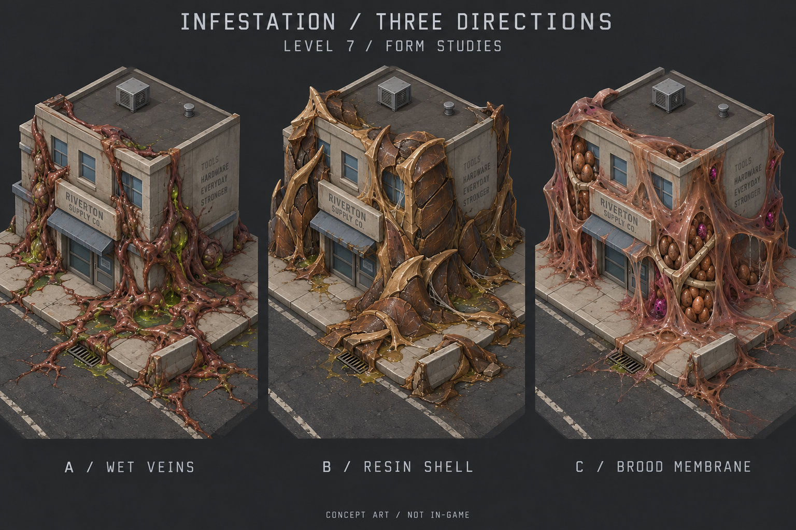
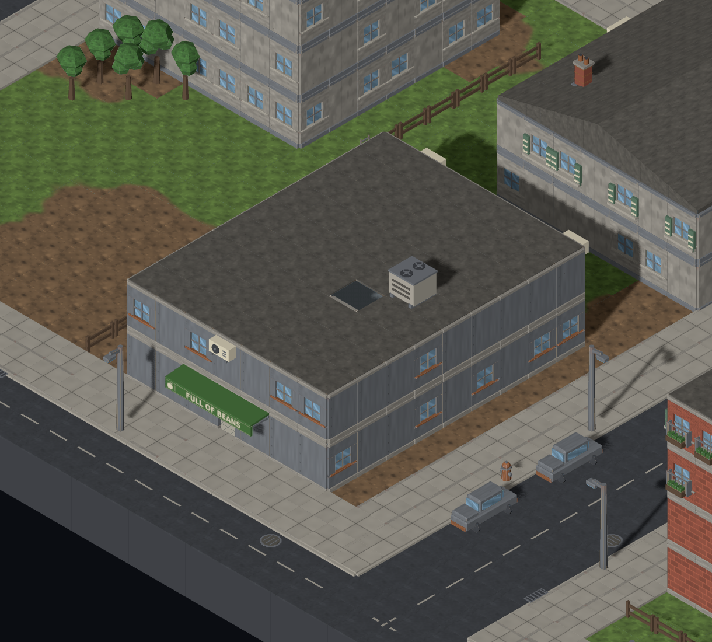
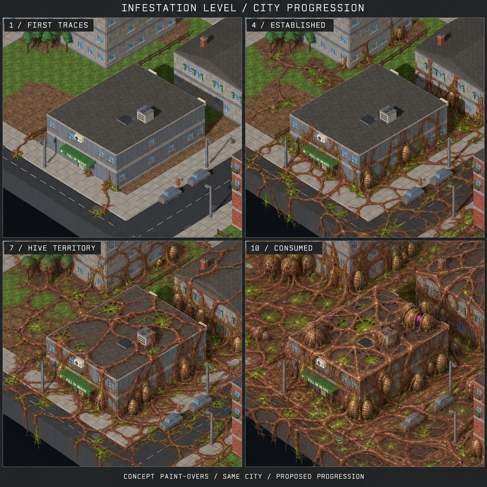
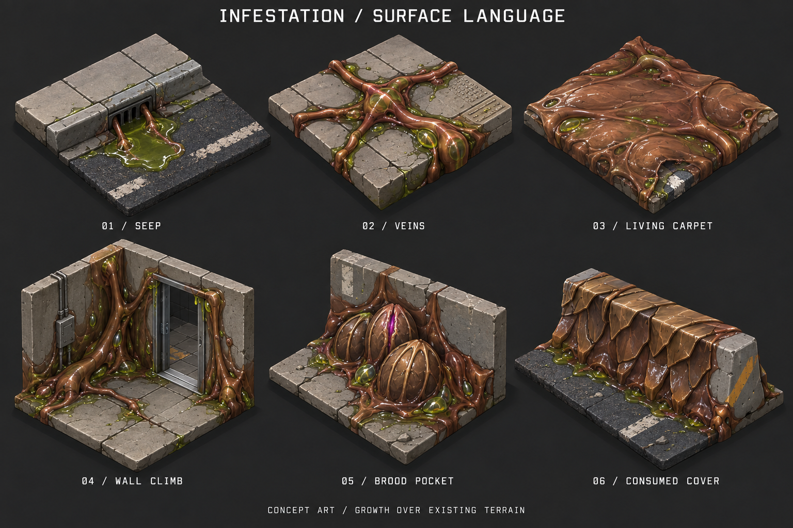

# Infestation Level — concept review

**B — Resin Shell selected · 2026-09-17 · [#1166](https://github.com/BenjaminBenetti/tut/issues/1166).** An **Infestation Level** dial from **0 to 10**, roughly corresponding to the overworld's **0–100** infestation meter. Level 0 preserves the current generated map. Level 10 should feel almost completely overtaken by a wet, creeping insect hive.

The user selected **B — Resin Shell**, approved the level progression and especially thick level 10, and requested **double movement distance cost on infested tiles** plus a **Map Lab slider**. The [implemented kit and actual progression screenshots](../../kits/resin-infestation.md) record that production work. The original generated sheets below remain concept references.

## Three visual directions

| Direction | Main impression | Review tradeoff |
|---|---|---|
| **A — Wet veins** | Fleshy tubes join sticky ground mats to foundations and walls; sick-green goop gathers in pockets. | Closest to the requested goop and veins. Needs broad mats at high levels so the result feels consumed rather than merely overgrown. |
| **B — Resin shell** | Walnut/chestnut carapace grows around existing structures with tan shell ridges. | Strong connection to the current bug family. Large projecting plates can obscure cover and entrances. |
| **C — Brood membrane** | Stretched wet skin, sticky filaments and ribbed egg pockets turn buildings into nesting surfaces. | Strongest creepy-hive feeling. Dense eggs and sheets need restraint so units and mission objectives remain identifiable. |

**Original blend explored in the sheets:** A supplies spreading veins and goop; B reinforces mature growth; C concentrates around advanced hive pockets. Production follows the subsequently selected **B** direction: layered brown shell, tan ridges and restrained wet seams, without decorative eggs that could be confused with mission objectives.

The alternatives share the same approximate level-7 intensity and similar city corners. Their coverage is illustrative, not measured or exactly matched. [Direction notes and prompt](directions.md).

## Level 0 — current map reference

This is the existing, **unaltered in-game screenshot** from the business-sign review, reused as the baseline and as the progression sheet's source image. Level 0 means the current seed, terrain, buildings, props and mission objectives remain as generated today; it does not imply removing existing bug objectives.

## Increasing infestation

The intended change is both **spread and maturity**: isolated traces connect into patches, patches join into a surface carpet, and that carpet envelops buildings and rooftops. At level 10, recognizable fragments of the original city should sit inside a hive.

These are generated concept paint-overs, not screenshots of an implemented feature or a deterministic same-seed test. Layout and lighting remain broadly comparable, but the generator changes small details. [Progression notes and prompt](progression.md).

| Dial | Approximate overworld equivalent | Proposed visual progression |
|---:|---:|---|
| **0** | **0** | Current map generation, unchanged; no new infestation dressing. |
| **1** | **10** | A few wet stains and short veins at drains or foundations. |
| **2** | **20** | More small patches, with branching tendrils around paving seams. |
| **3** | **30** | Adjacent patches connect; thicker veins begin binding curbs to walls. |
| **4** | **40** | Established ground pockets, lower-wall growth and occasional small sacs. |
| **5** | **50** | Wet mats occupy much of the ground; thicker veins connect building clusters. |
| **6** | **60** | Growth climbs upper walls and props; resin ribs reinforce mature patches. |
| **7** | **70** | Connected hive territory across streets and facades; roofs start being enveloped. |
| **8** | **80** | Broad living carpets, roof membranes and denser brood pockets; clean terrain becomes isolated. |
| **9** | **90** | Most surfaces are consumed; the city persists as silhouettes and small exposed fragments. |
| **10** | **100** | Almost complete transformation across ground, walls, roofs and vegetation; the entire map reads as a hive. |

The middle rows are proposed interpolation between the illustrated stages. The tenfold relationship is a review guide, not a decision about rounding overworld values or setting gameplay thresholds. Density, coverage and brood count are not balance values.

## Goop, veins and hive surfaces

The **living carpet** is especially important at the top of the dial: a continuous low organic skin makes the ground feel transformed. Merely adding more branching tubes leaves too much clean asphalt between them. Wall growth should visibly connect to the ground; resin should conform to existing cover.

These six pieces are shape studies, not an approved production kit. [Surface notes and prompt](surface-language.md).

## Art constraints for a later implementation

- Use the current brown bug family: russet flesh, walnut/chestnut shell, tan ribs, dark joints, sick-green residue, and small green or magenta biological accents. The overworld meter's green-to-red ramp conveys severity in UI; it does not require repainting terrain red.
- Grow infestation over the original terrain rather than replacing its base materials, following [style guide §4.3](../../style-guide.md). High coverage comes from organic forms and mats.
- Keep the existing orthographic view, daylight and recognizable building shapes. Wetness and anatomy should carry the creepiness; fog or darkness should not be required.
- Keep doors, stairs, paths, floor cuts and cover silhouettes legible. Surface dressing should not imply new obstacles where gameplay still permits movement.
- Preserve the distinction between decorative brood pockets and actual egg-spawner objectives. Decorative eggs in these concepts are a review question; they do not add spawns or rewards.
- Ground coverage should work across the map, including vegetation and natural terrain. These sheets study a temperate city; snow, desert, coastal terrain and cutaway interiors still need visual checks after direction selection.
- Generated sheen and fine detail exceed the current game's material simplicity. Production work should simplify them into broad shapes and restrained highlights, then check brown units against the infested ground at tactical zoom.

## Review decisions

1. **B — Resin Shell selected.** Keep the progression and make level 10 very thick.
2. **Gameplay:** entering infestation costs double movement distance.
3. **Validation:** add an Infestation Level slider to Map Lab. The production kit includes same-seed captures and a coverage table for review.

## Provenance

Generated on **2026-09-17** using the **built-in `image_gen` tool**, with the imagegen skill. The tool does not expose its image-model version. PNG files are copied unmodified from the generated outputs. Every sheet has a Markdown sidecar with exact prompt, inputs and keep/change notes.

| Sheet | Method | Exact prompt |
|---|---|---|
| [directions.png](directions.png) | New image; no image inputs | [directions.txt](prompts/directions.txt) |
| [progression.png](progression.png) | Edit/composite using the existing city screenshot above as its only image input | [progression.txt](prompts/progression.txt) |
| [surface-language.png](surface-language.png) | New image; no image inputs | [surface-language.txt](prompts/surface-language.txt) |

Art references: [style guide](../../style-guide.md), [implemented brown bug family](../../kits/crescent-bugs.md), [architecture §7](../../architecture.md), and [GDD §5.1–5.3](../../gdd.md). The generated concept images are unchanged; the linked production kit documents implemented assets and gameplay.
