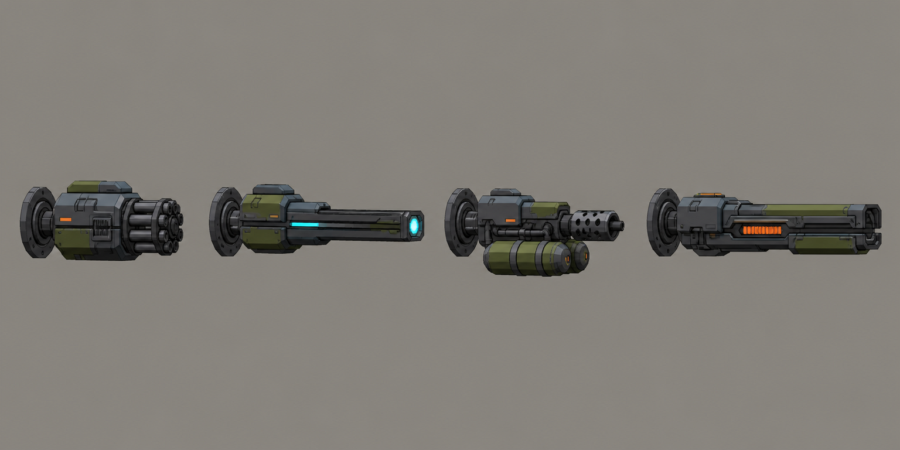

# Concept: Arm weapons: autocannon, laser, flamethrower, gauss rifle



- **Generator**: Codex CLI 0.152.1 built-in `image_gen` via `tools/art/gen-image.sh`.
- **Date**: 2026-09-02
- **Prompt file**: [`prompts/mech-arm-weapons.txt`](prompts/mech-arm-weapons.txt)
- **Style guide refs**: §3 mech, §4.1 palette, §6 sockets

## Prompt

```
Concept sheet of four interchangeable mech arm weapons laid out in a row as separate items on the same scale for a mech customisation screen, each with the same round mounting socket at the back: a rotary autocannon with a short thick barrel, a laser cannon with a long slim barrel and a cyan #7FD1FF emitter lens, a flamethrower with a stubby nozzle and two fuel tanks, and a gauss rifle with a long rectangular rail and orange charge indicator. Side view, wide landscape format. Low-poly game model style, flat shading, hard edges, clean fills with no gradients or noise, plain neutral grey background #8E8A82, no text, no labels, no watermark, no logos. Palette: primary armour cool grey #5B6573, joints and undersides dark grey #2E3440, secondary panels olive #6B7A3F, small orange #F08A24 markings under ten percent of surface, visor and optics glow #7FD1FF. Practical near-future military hardware, chunky, no anime proportions. Same design language as a boxy bipedal walker with a torso cockpit visor slit.
```

## Keep

- Same rear mounting ring on all four. Rotary autocannon short and thick, laser long with a cyan emitter, flamer with twin tanks, gauss with an orange charge indicator. Silhouettes differ at thumbnail size.

## Change next pass

- Flamer tanks hang below the mount and will clip the forearm; fold them alongside on the model.
- Laser and gauss are long; cap at 0.9 u so the arm plus weapon stays inside a tile and a half.
