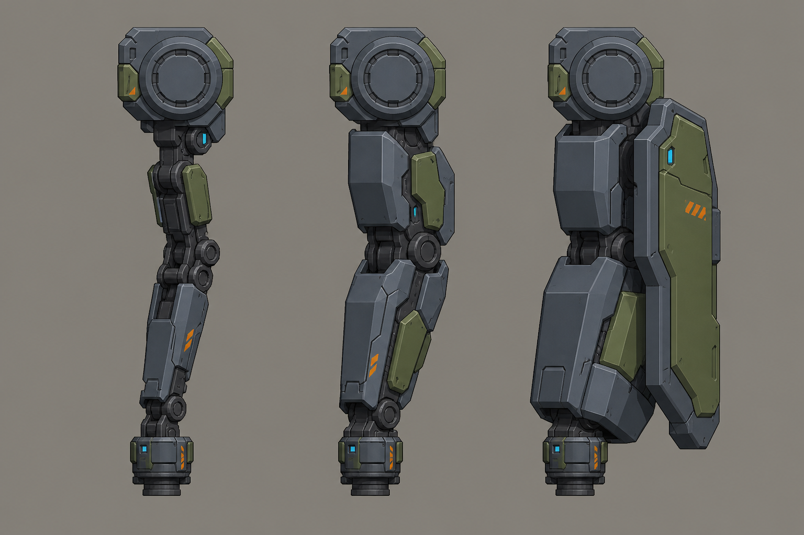

# Concept: Arm variants: light, standard, heavy with shield



- **Generator**: Codex CLI 0.152.1 built-in `image_gen` via `tools/art/gen-image.sh`.
- **Date**: 2026-09-02
- **Prompt file**: [`prompts/mech-arms-variants.txt`](prompts/mech-arms-variants.txt)
- **Style guide refs**: §3 mech, §4.1 palette, §6 sockets

## Prompt

```
Concept sheet of three interchangeable mech arm units side by side on the same scale for a mech customisation screen, each hanging from an identical round shoulder socket at the top and ending in an identical weapon mount socket at the wrist: left a light articulated manipulator arm, thin; centre a standard armoured arm; right a heavy arm with a thick forearm and a slab shield plate on the outside. Side view for each, wide landscape format. Low-poly game model style, flat shading, hard edges, clean fills with no gradients or noise, plain neutral grey background #8E8A82, no text, no labels, no watermark, no logos. Palette: primary armour cool grey #5B6573, joints and undersides dark grey #2E3440, secondary panels olive #6B7A3F, small orange #F08A24 markings under ten percent of surface, visor and optics glow #7FD1FF. Practical near-future military hardware, chunky, no anime proportions. Same design language as a boxy bipedal walker with a torso cockpit visor slit.
```

## Keep

- Identical shoulder ring at the top and identical wrist mount at the bottom on all three, which is exactly the socket contract. Light is a thin manipulator, standard armoured, heavy carries a slab shield as part of the arm.

## Change next pass

- Shield plate belongs to the heavy arm part (not a weapon), so the heavy arm GLB needs a wider footprint flag for tile clipping.
