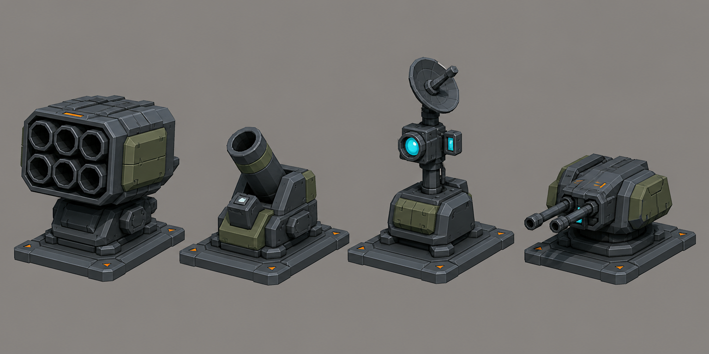

# Concept: Back modules: missile pod, mortar, sensor mast, point-defence turret



- **Generator**: Codex CLI 0.152.1 built-in `image_gen` via `tools/art/gen-image.sh`.
- **Date**: 2026-09-02
- **Prompt file**: [`prompts/mech-back-weapons.txt`](prompts/mech-back-weapons.txt)
- **Style guide refs**: §3 mech, §4.1 palette, §6 sockets

## Prompt

```
Concept sheet of four interchangeable mech back-mounted modules laid out in a row as separate items on the same scale for a mech customisation screen, each with the same flat rectangular mounting plate underneath: a six-tube missile pod, a short mortar tube on an angled mount, a sensor mast with a small dish and cyan #7FD1FF optics, and a compact point-defence turret with twin small barrels. Three-quarter view, wide landscape format. Low-poly game model style, flat shading, hard edges, clean fills with no gradients or noise, plain neutral grey background #8E8A82, no text, no labels, no watermark, no logos. Palette: primary armour cool grey #5B6573, joints and undersides dark grey #2E3440, secondary panels olive #6B7A3F, small orange #F08A24 markings under ten percent of surface, visor and optics glow #7FD1FF. Practical near-future military hardware, chunky, no anime proportions. Same design language as a boxy bipedal walker with a torso cockpit visor slit.
```

## Keep

- Same flat mounting plate with orange corner marks on all four. Missile pod is the baseline; mortar angled; sensor mast with dish and cyan optics is a utility slot; PD turret with twin barrels.

## Change next pass

- Sensor mast is tall; cap back modules at 0.8 u above `socket_back` so the tallest mech stays under 3.2 u.
- Mounting plates should be smaller than the module footprint on the model (they read oversized here).
