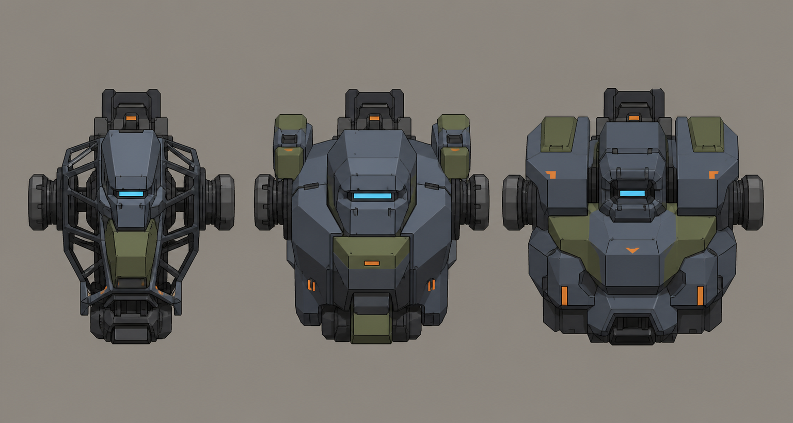

# Concept: Chassis variants: light, standard, heavy



- **Generator**: Codex CLI 0.152.1 built-in `image_gen` via `tools/art/gen-image.sh`.
- **Date**: 2026-09-02
- **Prompt file**: [`prompts/mech-chassis-variants.txt`](prompts/mech-chassis-variants.txt)
- **Style guide refs**: §3 mech, §4.1 palette, §6 sockets

## Prompt

```
Concept sheet of three interchangeable mech chassis (torso units only, no legs, no arms, no weapons) side by side on the same scale for a mech customisation screen: left a light scout chassis, slim with a narrow cockpit and exposed frame; centre a standard chassis, boxy with shoulder mounts and a visor slit; right a heavy chassis, wide with thick layered armour plates and a small recessed cockpit. Each shows the same round arm sockets on both sides and a back mount on top so the parts read as interchangeable. Front view for each, wide landscape format. Low-poly game model style, flat shading, hard edges, clean fills with no gradients or noise, plain neutral grey background #8E8A82, no text, no labels, no watermark, no logos. Palette: primary armour cool grey #5B6573, joints and undersides dark grey #2E3440, secondary panels olive #6B7A3F, small orange #F08A24 markings under ten percent of surface, visor and optics glow #7FD1FF. Practical near-future military hardware, chunky, no anime proportions. Same design language as a boxy bipedal walker with a torso cockpit visor slit.
```

## Keep

- Same visor language and identical round arm sockets on all three so they read as swappable. Light is slim with exposed frame, standard is the baseline from `../mech.png`, heavy is wide with layered plates. Front views at one scale.

## Change next pass

- Light chassis exposed frame is too much detail for the budget; model it as a slimmer box with two cut-outs.
- Heavy chassis shoulders must stay within 1.4 u (style guide §3).
