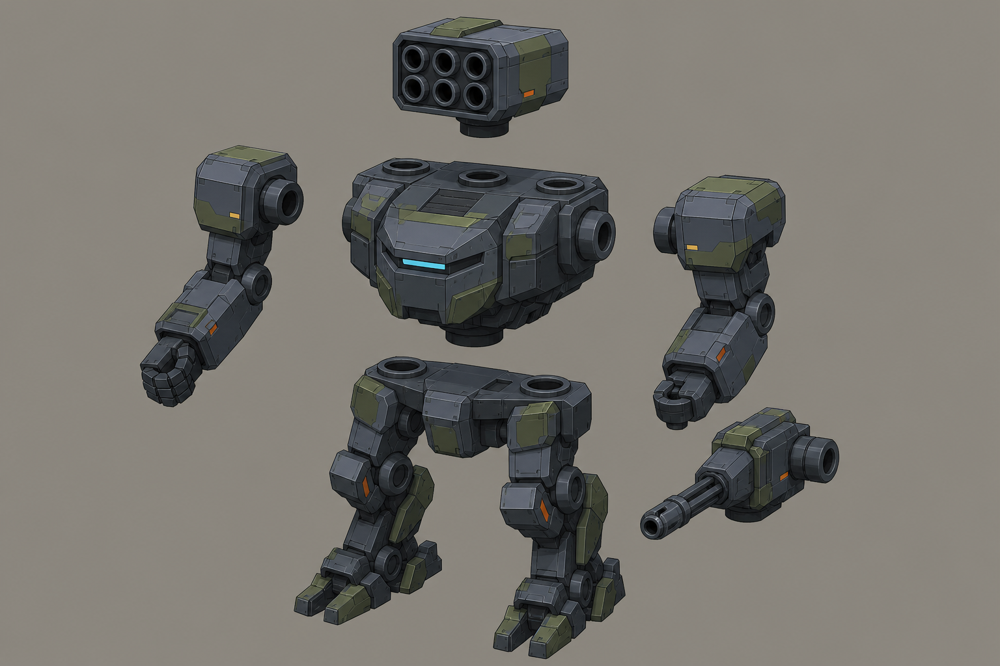

# Concept: Mech exploded view



- **Generator**: Codex CLI 0.152.1 built-in `image_gen` via `tools/art/gen-image.sh`.
- **Date**: 2026-09-02
- **Prompt file**: [`prompts/mech-exploded.txt`](prompts/mech-exploded.txt)
- **Style guide refs**: §3 mech, §4.1 palette, §6 sockets

## Prompt

```
Exploded-view concept sheet of one modular TDF combat mech for a mech customisation screen: the six parts are pulled apart vertically with clear gaps and simple round connector pegs and sockets visible where they join: at the top a back weapon (six-tube missile pod) above the torso; the chassis (torso with cockpit visor slit and shoulder mounts) in the middle; the left arm and right arm floating out to the sides, the right arm holding an autocannon shown as its own detachable piece; the legs (pelvis with two digitigrade legs and feet) at the bottom. Isometric three-quarter view from 35 degrees above, wide landscape format. Low-poly game model style, flat shading, hard edges, clean fills with no gradients or noise, plain neutral grey background #8E8A82, no text, no labels, no watermark, no logos. Palette: primary armour cool grey #5B6573, joints and undersides dark grey #2E3440, secondary panels olive #6B7A3F, small orange #F08A24 markings under ten percent of surface, visor and optics glow #7FD1FF. Practical near-future military hardware, chunky, no anime proportions. Same design language as a boxy bipedal walker with a torso cockpit visor slit.
```

## Keep

- Six parts with visible round pegs and sockets: back weapon above the chassis, chassis with cockpit visor and shoulder sockets, left arm (fist), right arm with the autocannon shown as its own piece, legs unit with pelvis socket. This is the placeholder part split (`socket_chassis`, `socket_arm_l/r`, `socket_back`, `socket_weapon`) drawn as one image; the mech bay can use it as the empty-slot diagram.

## Change next pass

- Show both arms with the same wrist socket (the left fist reads as a fixed hand); on the model a fist is a weapon-slot filler, not part of the arm.
