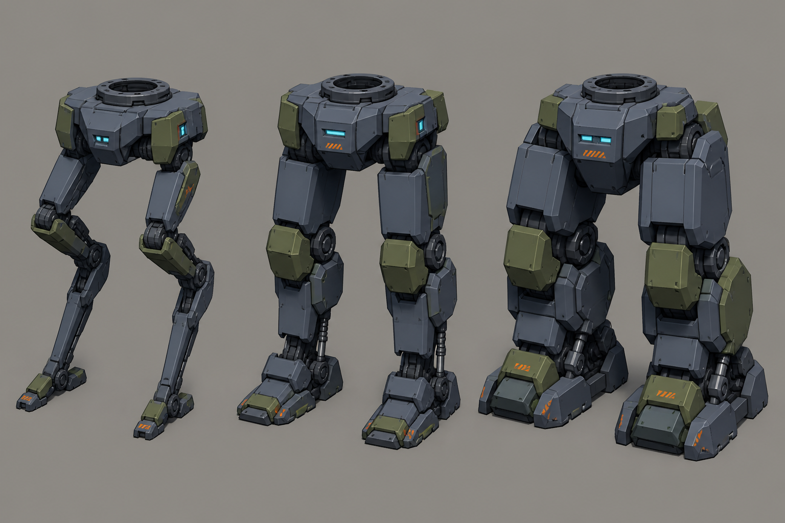

# Concept: Leg variants: runner, standard, heavy



- **Generator**: Codex CLI 0.152.1 built-in `image_gen` via `tools/art/gen-image.sh`.
- **Date**: 2026-09-02
- **Prompt file**: [`prompts/mech-legs-variants.txt`](prompts/mech-legs-variants.txt)
- **Style guide refs**: §3 mech, §4.1 palette, §6 sockets

## Prompt

```
Concept sheet of three interchangeable mech leg units (pelvis plus two legs and feet, no torso) side by side on the same scale for a mech customisation screen: left light digitigrade runner legs, thin and long with small feet; centre standard bipedal legs, boxy with knee armour; right heavy legs, short, thick, with wide stabiliser feet. Each shows the same round socket on top of the pelvis so they read as interchangeable. Three-quarter view for each, wide landscape format. Low-poly game model style, flat shading, hard edges, clean fills with no gradients or noise, plain neutral grey background #8E8A82, no text, no labels, no watermark, no logos. Palette: primary armour cool grey #5B6573, joints and undersides dark grey #2E3440, secondary panels olive #6B7A3F, small orange #F08A24 markings under ten percent of surface, visor and optics glow #7FD1FF. Practical near-future military hardware, chunky, no anime proportions. Same design language as a boxy bipedal walker with a torso cockpit visor slit.
```

## Keep

- Identical pelvis socket ring on top; runner legs long and digitigrade, standard boxy with knee armour, heavy short and thick with wide stabiliser feet. Orange hazard marks on feet.

## Change next pass

- Heavy feet spread past a tile edge in the sheet; on the model keep the stance inside 1.0 u.
- Runner legs raise the chassis; total mech height stays 2.4–3.2 u, so runner + heavy chassis may need a shorter thigh.
