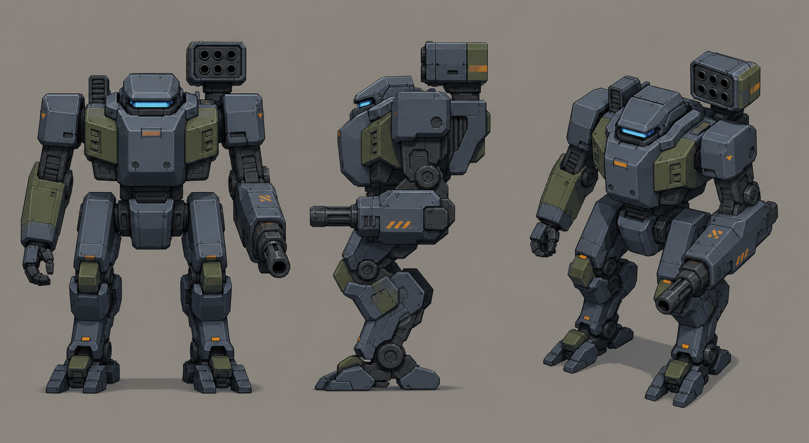

# Concept: TDF mech, baseline chassis



- **Generator**: Codex CLI 0.152.1 built-in `image_gen` (model gpt-5.6-sol session; image model as served by the tool), via `tools/art/gen-image.sh`.
- **Date**: 2026-09-02
- **Prompt file**: [`prompts/mech.txt`](prompts/mech.txt) (exact text passed to the generator, plus the standard save-path suffix the script appends)
- **Style guide refs**: §3 scale/silhouette, §4 palette

## Prompt

```
Concept sheet for a TDF combat mech from a near-future Earth turn-based tactics game. A chunky bipedal walker about 5 metres tall: tall rectangular torso with shoulders wider than hips, thick digitigrade legs, and clearly modular pieces that read as separate detachable parts: chassis, two legs, left arm, right arm ending in an autocannon, a boxy missile pod mounted on the back over the right shoulder, and a small armoured cockpit with a visor slit at the top. Practical military hardware, no anime proportions, no rounded cute shapes. Colours: primary armour cool grey #5B6573, joints and undersides dark grey #2E3440, secondary panels olive #6B7A3F, small orange #F08A24 unit markings and hazard stripes covering under ten percent of the surface, visor glow #7FD1FF. Low-poly game model style, flat shading, hard edges, clean vector-like fills with no gradients or noise, plain neutral grey background #8E8A82, no text, no labels, no watermark, no logos. Wide landscape concept sheet showing the same design three times side by side: front view, side view, and isometric three-quarter view from 35 degrees above.
```

## Keep

- Modular read: chassis, legs, arms, arm autocannon and back missile pod are visibly separate pieces. This is the reference for the GLB part split (`socket_arm_l/r`, `socket_back`).
- Shoulders wider than hips, digitigrade legs, cockpit visor slit. Palette is on-spec: grey-mid armour, grey-dark joints, olive panels, orange under 10 %.

## Change next pass

- Left hand is a fist; production model should carry a second arm weapon or a shield-style plate so both arms read as slots.
- Reduce panel-line density for the in-game model; at 48 px per tile only the big blocks survive.
