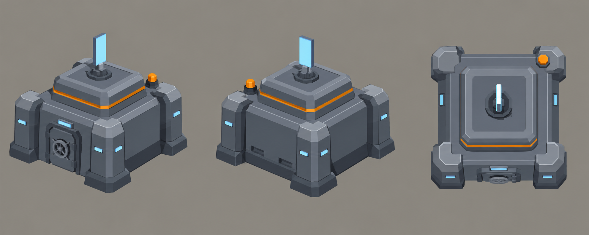

# Concept: strategic-map bank



- **Generator**: Codex CLI built-in image generation, via `tools/art/gen-image.sh`.
- **Date**: 2026-09-17
- **Prompt file**: [`prompts/overworld-bank.txt`](prompts/overworld-bank.txt) (exact text passed to the generator, plus the standard save-path suffix the script appends)
- **Style guide refs**: §4.1 TDF palette, §6 conventions; issues #1153 (footprint 0.45 × 0.45 u, height ≤ 0.3 u, one `animated` child node) and #1155 (the bank, GDD §5.6)
- **Siblings**: [overworld-deployables](overworld-deployables.md) (defensive battery, repellent dispersal, sensor array)

## Prompt

```
Concept sheet of one small TDF reserve bank installation from a near-future Earth turn-based tactics game, a tiny secure vault building that will sit on a dark strategic map viewed from above, in the same family as three sibling military installations. A compact squat vault block with thick chamfered corner pillars and a stepped roof rising in two tiers to a flat top, a small armoured door with a round vault wheel on the front face, and rising from the roof centre a short mast carrying a rotating holographic credit sign, a slim rectangular glowing pale blue panel that can turn about the mast. One small orange beacon on a roof corner and a single orange band around the top tier. The building is tiny, roughly one metre tall, blocky and chunky so it reads at very small size. Colours: primary armour cool grey #5B6573, joints and undersides dark grey #2E3440, edge highlights light grey #9AA5B1, small orange #F08A24 markings covering under ten percent of the surface, the holographic sign and status lights pale blue #7FD1FF. Low-poly game model style, flat shading, hard edges, clean vector-like fills with no gradients or noise, isometric three-quarter view from 60 degrees above so the roof and top dominate, plain neutral grey background #8E8A82, no text, no labels, no watermark, no logos. Wide landscape concept sheet showing the same installation three times evenly spaced in a single row: front three-quarter view, rear three-quarter view, and a straight top-down view.
```

## Keep

- A fourth silhouette that differs from the other three from above: a square block with four dark corner pillars standing proud of a two-tier stepped roof. Neither octagon, nor tank-and-tower, nor hut-and-dish.
- One moving part, the holographic credit sign on a short mast at the roof centre: the `animated` node, turning slowly about the mast (`deployable-animations.ts`, one turn per 20 s).
- Palette on-spec: grey-mid vault, grey-dark pillars and door, light-grey cornice, one orange band under the cornice plus a single orange beacon on a roof corner, pale blue sign and vault-wheel hub.
- The armoured door with its round wheel marks the front (−Y in Blender, +Z in glTF), like the barrels and spout on the siblings.

## Change next pass

- The sheet's chamfered pillar caps and per-pillar blue slots cost more triangles than a 300-triangle prop allows; the model keeps the pillars as plain dark posts with one blue slot on the side wall.
- The sign is drawn as a tall portrait panel; the model widens it slightly so the turning reads at map scale, where the panel is a few pixels across.
