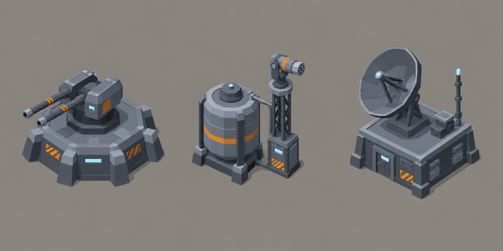

# Concept: strategic-map deployables



- **Generator**: Codex CLI 0.154.0 built-in image generation, via `tools/art/gen-image.sh`.
- **Date**: 2026-09-16
- **Prompt file**: [`prompts/overworld-deployables.txt`](prompts/overworld-deployables.txt) (exact text passed to the generator, plus the standard save-path suffix the script appends)
- **Style guide refs**: §4.1 TDF palette, §6 conventions; issue #1153 (footprint 0.45 × 0.45 u, height ≤ 0.3 u, one `animated` child node)

## Prompt

```
Concept sheet of three small TDF military installations from a near-future Earth turn-based tactics game, shown side by side as tiny buildings that will sit on a dark strategic map viewed from above. Left: a defensive battery, a squat armoured emplacement with a low octagonal bunker base and a rotating twin-barrel gun mount on top. Centre: a repellent dispersal unit, a fat cylindrical tank beside a slim tower topped by a rotating nozzle head that visibly could spray aerosol. Right: a sensor array, a small flat-roofed hut with a mast and a large tilted radar dish on top. All three are the same tiny scale, roughly one metre tall, blocky and chunky so they read at very small size. Colours: primary armour cool grey #5B6573, joints and undersides dark grey #2E3440, edge highlights light grey #9AA5B1, small orange #F08A24 markings and warning stripes covering under ten percent of the surface, lenses and status lights pale blue #7FD1FF. Low-poly game model style, flat shading, hard edges, clean vector-like fills with no gradients or noise, isometric three-quarter view from 60 degrees above so the roofs and tops dominate, plain neutral grey background #8E8A82, no text, no labels, no watermark, no logos. Wide landscape concept sheet with the three installations evenly spaced in a single row.
```

## Keep

- Three silhouettes that differ from above: a flat octagon with two barrels, a round tank beside a tall thin tower, a square roof under a big tilted disc. This is what the models reproduce.
- One moving part per installation, clearly separable from its base: gun mount on a collar, nozzle head on the tower top, dish on a pedestal. These are the `animated` nodes.
- Palette on-spec: grey-mid bodies, grey-dark undersides and pipes, one orange band or stripe each, pale blue lenses.

## Change next pass

- The sheet is drawn at desk scale; in the models the tower and mast are shortened so every installation fits under 0.3 u and the dish never sweeps past the 0.45 u footprint.
- The lattice tower and hut-roof pedestal cost too many triangles for a 300-triangle prop; the models use a ribbed column and a ground-standing mast instead.
