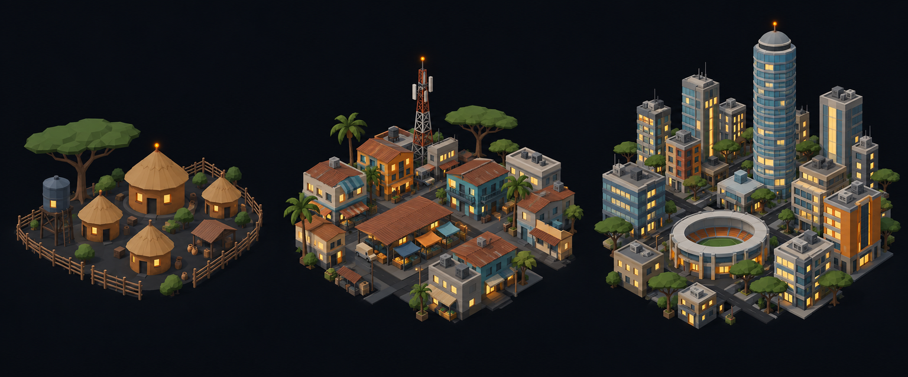

# Concept: Overworld settlement markers, Sub-Saharan African



- **Generator**: Codex CLI 0.154.0 built-in image generation, via `tools/art/gen-image.sh`.
- **Date**: 2026-09-16
- **Prompt file**: [`prompts/overworld-settlement-african.txt`](prompts/overworld-settlement-african.txt) (exact text passed to the generator, plus the standard save-path suffix the script appends)
- **Style guide refs**: §4.2 bug palette, §4.3 environment palette, §6 budgets
- **Drives**: `overworld.settlement.african.{rural,town,city}` and `overworld.settlement-eggs.african.{rural,town,city}` (#1155), built by `tools/art/models/settlement_styles.py` (`AFRICAN`) on top of `settlement_parts.py`
- **Regions**: sub-saharan-africa (`src/graphics/data/settlement-styles.ts`)

## Prompt

```
Concept sheet for tiny strategic-map settlement markers from a near-future Earth turn-based tactics game, each a cluster of low-poly buildings standing directly on flat dark ground with no base, plate, disc or ring under them, seen from a three-quarter view about 55 degrees above so rooftops and one lit facade read together. Three clusters side by side on one row, a density ladder from left to right: first a rural hamlet, second a town, third a dense city block with one tall landmark. Architectural style: Sub-Saharan African. Rural: a compound of round thatched huts with conical straw roofs #B88B58 and ochre mud walls #8C5A3A inside a low stick fence, an acacia tree with a flat crown #3F6B33, a water tank. Town: low concrete blocks #8E8A82 with corrugated rust-red iron roofs #8C5A3A and bright painted facades in orange #F08A24 and teal #3F8FA8, a market shed, a radio mast, palm and acacia trees. City: a modern skyline of concrete and glass towers #6E8FA6 with a distinctive cylindrical tower with a rounded crown as the landmark, mid-rise blocks with coloured facades, a stadium ring, acacia trees between. Every building has small warm lit windows #FFD08A on the faces toward the viewer, and the tallest structure of each cluster carries one small orange beacon light #F08A24. Dark asphalt street gaps #3A3D42 between blocks. Low-poly game model style, flat shading, hard edges, clean vector-like fills with no gradients or noise, plain dark blue-black background #0B0D12, no text, no labels, no watermark, no logos. Wide landscape concept sheet showing the three clusters evenly spaced in one row.
```

## Keep

- Round thatched huts with conical straw roofs inside a stick fence, one acacia with a flat crown; then rust-red corrugated roofs with painted orange and teal facades and a radio mast; then a cylindrical tower with a rounded crown as the city landmark and a stadium ring.
- The rural compound is the only round-plan settlement in the set, which is what separates it from every other hamlet at 20 px.

## Change next pass

- The stadium is a low eight-sided drum with a grass bowl wedged between the towers, not a ring; it is the only round footprint in the city and must stay smaller than the towers so it never reads as a base disc.
- The radio mast becomes a four-sided tapering mast with two cross bars and the beacon; the antenna panels are below the pixel budget.
