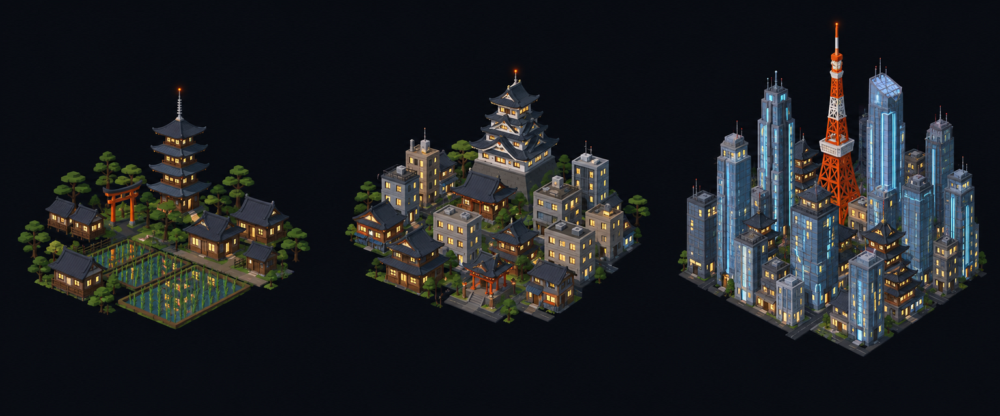

# Concept: Overworld settlement markers, East Asian



- **Generator**: Codex CLI 0.154.0 built-in image generation, via `tools/art/gen-image.sh`.
- **Date**: 2026-09-16
- **Prompt file**: [`prompts/overworld-settlement-east-asian.txt`](prompts/overworld-settlement-east-asian.txt) (exact text passed to the generator, plus the standard save-path suffix the script appends)
- **Style guide refs**: §4.2 bug palette, §4.3 environment palette, §6 budgets
- **Drives**: `overworld.settlement.east-asian.{rural,town,city}` and `overworld.settlement-eggs.east-asian.{rural,town,city}` (#1155), built by `tools/art/models/settlement_styles.py` (`EAST_ASIAN`) on top of `settlement_parts.py`
- **Regions**: east-asia (`src/graphics/data/settlement-styles.ts`)

## Prompt

```
Concept sheet for tiny strategic-map settlement markers from a near-future Earth turn-based tactics game, each a cluster of low-poly buildings standing directly on flat dark ground with no base, plate, disc or ring under them, seen from a three-quarter view about 55 degrees above so rooftops and one lit facade read together. Three clusters side by side on one row, a density ladder from left to right: first a rural hamlet, second a town, third a dense city block with one tall landmark. Architectural style: East Asian, Japan, Korea and China. Rural: a village of low wooden houses #5A4634 with wide sweeping pagoda-style tiled roofs #2E3440 with upturned eaves, a five-storey pagoda, a red torii gate #B86414, pine trees #3F6B33 and a rice paddy. Town: a mix of compact grey concrete blocks #8E8A82 with flat roofs and a few traditional curved-eave halls, a small shrine, a castle keep with stacked curved roofs. City: an ultra-dense skyline of slender glass towers #6E8FA6 with tapered and stepped tops, a few traditional curved-eave rooftops between them, a red-and-white Tokyo-Tower-like lattice tower #F08A24 as the landmark, cool cyan neon light strips #7FD1FF on some tower faces. Every building has small warm lit windows #FFD08A on the faces toward the viewer, and the tallest structure of each cluster carries one small orange beacon light #F08A24. Dark asphalt street gaps #3A3D42 between blocks. Low-poly game model style, flat shading, hard edges, clean vector-like fills with no gradients or noise, plain dark blue-black background #0B0D12, no text, no labels, no watermark, no logos. Wide landscape concept sheet showing the three clusters evenly spaced in one row.
```

## Keep

- Sweeping dark pagoda-style roofs with upturned eaves on wooden houses, a five-storey pagoda and a red torii gate for the hamlet; a castle keep with stacked curved roofs for the town; a forest of slender tapered glass towers with cyan neon strips around a red-and-white lattice tower for the city.
- Slender tower proportions plus the orange lattice landmark are what make Tokyo unmistakable next to New York's box grid.

## Change next pass

- The rice paddy is one thin water-toned slab beside the torii; pines come from the template's tree slots, so the hamlet is the pagoda, the gate, the paddy and curved-roof houses.
- Neon is one visor-cyan strip per lit tower face in the model (the style's accent token); the sheet's per-window colour variation is beyond the budget. The castle keep is a rock plinth with three shrinking floors under pagoda roofs.
