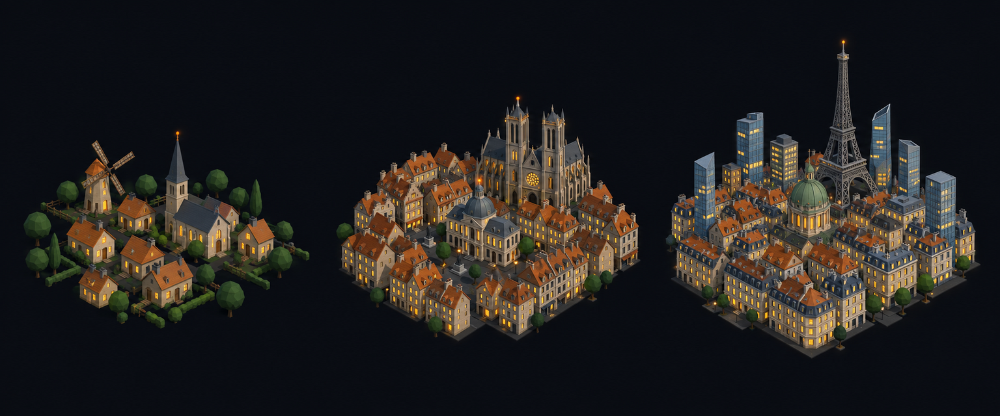

# Concept: Overworld settlement markers, Western European



- **Generator**: Codex CLI 0.154.0 built-in image generation, via `tools/art/gen-image.sh`.
- **Date**: 2026-09-16
- **Prompt file**: [`prompts/overworld-settlement-european.txt`](prompts/overworld-settlement-european.txt) (exact text passed to the generator, plus the standard save-path suffix the script appends)
- **Style guide refs**: §4.2 bug palette, §4.3 environment palette, §6 budgets
- **Drives**: `overworld.settlement.european.{rural,town,city}` and `overworld.settlement-eggs.european.{rural,town,city}` (#1155), built by `tools/art/models/settlement_styles.py` (`EUROPEAN`) on top of `settlement_parts.py`
- **Regions**: western-europe, mediterranean-basin, arctic-north-atlantic (`src/graphics/data/settlement-styles.ts`)

## Prompt

```
Concept sheet for tiny strategic-map settlement markers from a near-future Earth turn-based tactics game, each a cluster of low-poly buildings standing directly on flat dark ground with no base, plate, disc or ring under them, seen from a three-quarter view about 55 degrees above so rooftops and one lit facade read together. Three clusters side by side on one row, a density ladder from left to right: first a rural hamlet, second a town, third a dense city block with one tall landmark. Architectural style: Western European. Rural: a village of narrow stone and warm plaster houses #C8B990 with steep ochre-orange tiled roofs #B86414 clustered around a small church with a pointed grey slate spire, a windmill, hedges and round trees #3F6B33. Town: tight rows of terraced houses with ochre pitched roofs and chimneys around a square, a domed town hall, one Gothic cathedral with twin towers. City: an old core of low ochre-roofed blocks and a green copper dome #5B706A, ringed by a few modern glass towers #6E8FA6, the landmark one slender glass tower with a lattice top or an Eiffel-like iron lattice tower #6F7378. Every building has small warm lit windows #FFD08A on the faces toward the viewer, and the tallest structure of each cluster carries one small orange beacon light #F08A24. Dark asphalt street gaps #3A3D42 between blocks. Low-poly game model style, flat shading, hard edges, clean vector-like fills with no gradients or noise, plain dark blue-black background #0B0D12, no text, no labels, no watermark, no logos. Wide landscape concept sheet showing the three clusters evenly spaced in one row.
```

## Keep

- Ochre pitched roofs and warm plaster walls at every scale, with a church spire (rural), a twin-tower cathedral (town) and a copper dome ringed by a few glass towers (city).
- An iron lattice tower as the city landmark: a taller, thinner spike than anything in the North American or Slavic sheets.

## Change next pass

- The generator drew the town as an old core without any modern slab; the model's town template still carries its mid-rise slots, with pitched ochre roofs, so the density step from hamlet to town reads.
- The windmill survives as a six-sided body with two crossed sail bars in the companion slot; the spire church carries the beacon. The copper dome sits on one city mid-rise rather than on a domed hall of its own.
