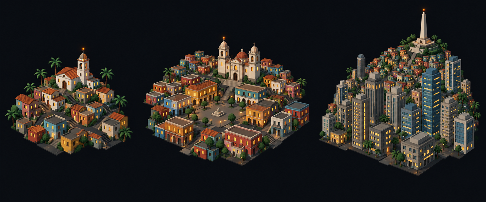

# Concept: Overworld settlement markers, Latin American



- **Generator**: Codex CLI 0.154.0 built-in image generation, via `tools/art/gen-image.sh`.
- **Date**: 2026-09-16
- **Prompt file**: [`prompts/overworld-settlement-latin-american.txt`](prompts/overworld-settlement-latin-american.txt) (exact text passed to the generator, plus the standard save-path suffix the script appends)
- **Style guide refs**: §4.2 bug palette, §4.3 environment palette, §6 budgets
- **Drives**: `overworld.settlement.latin-american.{rural,town,city}` and `overworld.settlement-eggs.latin-american.{rural,town,city}` (#1155), built by `tools/art/models/settlement_styles.py` (`LATIN_AMERICAN`) on top of `settlement_parts.py`
- **Regions**: latin-america, amazon-basin, andes-pacific (`src/graphics/data/settlement-styles.ts`)

## Prompt

```
Concept sheet for tiny strategic-map settlement markers from a near-future Earth turn-based tactics game, each a cluster of low-poly buildings standing directly on flat dark ground with no base, plate, disc or ring under them, seen from a three-quarter view about 55 degrees above so rooftops and one lit facade read together. Three clusters side by side on one row, a density ladder from left to right: first a rural hamlet, second a town, third a dense city block with one tall landmark. Architectural style: Latin American. Rural: a hillside village of small cubic houses in bright painted colours, terracotta #8A4B3A, yellow #D9B87A and teal #3F8FA8, with flat and terracotta-tiled roofs, a white colonial church with a bell tower, palm trees #39714E. Town: a dense hillside cluster of cubic houses in stepped terraces of many colours, a colonial cathedral with two bell towers and a dome, a plaza. City: a broad skyline of concrete high-rise slabs #8E8A82 and glass towers #6E8FA6 climbing a hill, favela-like cubic clusters on the slope, the landmark a monument on the summit, a tall white statue or obelisk on a pedestal, lit orange. Every building has small warm lit windows #FFD08A on the faces toward the viewer, and the tallest structure of each cluster carries one small orange beacon light #F08A24. Dark asphalt street gaps #3A3D42 between blocks. Low-poly game model style, flat shading, hard edges, clean vector-like fills with no gradients or noise, plain dark blue-black background #0B0D12, no text, no labels, no watermark, no logos. Wide landscape concept sheet showing the three clusters evenly spaced in one row.
```

## Keep

- Cubic houses in terracotta, yellow and teal stepped up a hillside, a white colonial church with a bell tower for the hamlet, a two-tower cathedral with a dome on a plaza for the town, and concrete slabs and glass towers climbing to an obelisk monument on the summit for the city.
- Bright multi-colour facades and terracotta tile at every scale separate it from the pastel South Asian sheet.

## Change next pass

- The hillside is drawn as terraces; the model uses one green mound in the back corner of the city plot carrying a pedestal, statue and outstretched arms, with four coloured cubes on its flank.
- Plaza and its statue are dropped from the town; the domed twin-tower cathedral carries the beacon.
