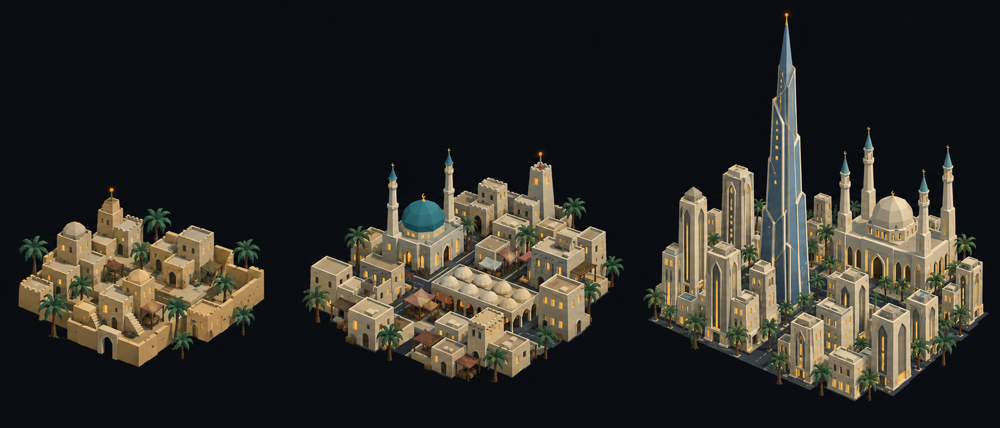

# Concept: Overworld settlement markers, Middle Eastern



- **Generator**: Codex CLI 0.154.0 built-in image generation, via `tools/art/gen-image.sh`.
- **Date**: 2026-09-16
- **Prompt file**: [`prompts/overworld-settlement-middle-eastern.txt`](prompts/overworld-settlement-middle-eastern.txt) (exact text passed to the generator, plus the standard save-path suffix the script appends)
- **Style guide refs**: §4.2 bug palette, §4.3 environment palette, §6 budgets
- **Drives**: `overworld.settlement.middle-eastern.{rural,town,city}` and `overworld.settlement-eggs.middle-eastern.{rural,town,city}` (#1155), built by `tools/art/models/settlement_styles.py` (`MIDDLE_EASTERN`) on top of `settlement_parts.py`
- **Regions**: middle-east (`src/graphics/data/settlement-styles.ts`)

## Prompt

```
Concept sheet for tiny strategic-map settlement markers from a near-future Earth turn-based tactics game, each a cluster of low-poly buildings standing directly on flat dark ground with no base, plate, disc or ring under them, seen from a three-quarter view about 55 degrees above so rooftops and one lit facade read together. Three clusters side by side on one row, a density ladder from left to right: first a rural hamlet, second a town, third a dense city block with one tall landmark. Architectural style: Middle Eastern. Rural: a walled village of cubic sand-coloured mud-brick houses #D9B87A with flat roofs, small domes, a courtyard wall, date palms #39714E with trunks #786348. Town: dense flat-roofed sand and limestone #BDB69A blocks, a mosque with a large turquoise dome #3F8FA8 and two slender minarets, a covered bazaar with small domes. City: pale sand-toned towers with pointed arch motifs and one enormous ultra-tall tapering needle skyscraper in glass #6E8FA6 as the landmark, a grand mosque with a large dome and four minarets, palms along the streets. Every building has small warm lit windows #FFD08A on the faces toward the viewer, and the tallest structure of each cluster carries one small orange beacon light #F08A24. Dark asphalt street gaps #3A3D42 between blocks. Low-poly game model style, flat shading, hard edges, clean vector-like fills with no gradients or noise, plain dark blue-black background #0B0D12, no text, no labels, no watermark, no logos. Wide landscape concept sheet showing the three clusters evenly spaced in one row.
```

## Keep

- Sand-toned cubic flat-roofed blocks at every scale, small domes and a courtyard wall on the hamlet, a turquoise-domed mosque with two minarets on the town, and one ultra-tall tapering glass needle over a four-minaret mosque in the city.
- Date palms as the only greenery, so the cluster reads as arid next to the European hedges and trees.

## Change next pass

- The city needle is drawn far taller than the plot is wide; the model builds it as three tapering glass drums (about 1.2 times the landmark slot's height) plus a short cone, so it does not overlap neighbouring markers on the map.
- Pointed-arch facades are dropped; windows stay plain lit rectangles.
