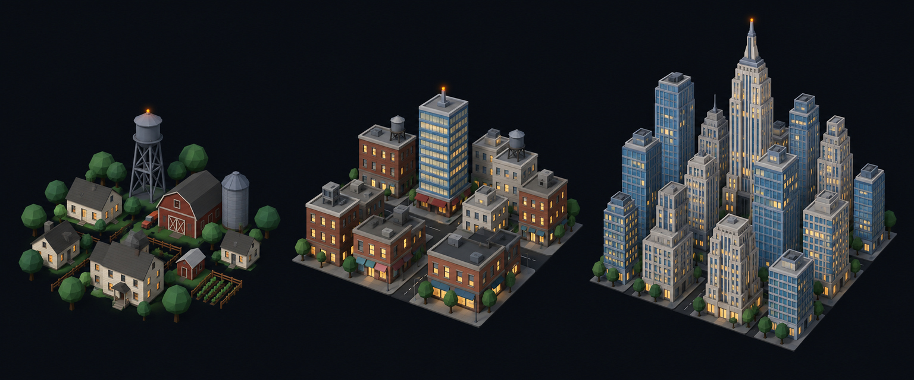

# Concept: Overworld settlement markers, North American



- **Generator**: Codex CLI 0.154.0 built-in image generation, via `tools/art/gen-image.sh`.
- **Date**: 2026-09-16
- **Prompt file**: [`prompts/overworld-settlement-north-american.txt`](prompts/overworld-settlement-north-american.txt) (exact text passed to the generator, plus the standard save-path suffix the script appends)
- **Style guide refs**: §4.2 bug palette, §4.3 environment palette, §6 budgets
- **Drives**: `overworld.settlement.north-american.{rural,town,city}` and `overworld.settlement-eggs.north-american.{rural,town,city}` (#1155), built by `tools/art/models/settlement_styles.py` (`NORTH_AMERICAN`) on top of `settlement_parts.py`
- **Regions**: north-america-west, north-america-east, boreal-north-america (`src/graphics/data/settlement-styles.ts`)

## Prompt

```
Concept sheet for tiny strategic-map settlement markers from a near-future Earth turn-based tactics game, each a cluster of low-poly buildings standing directly on flat dark ground with no base, plate, disc or ring under them, seen from a three-quarter view about 55 degrees above so rooftops and one lit facade read together. Three clusters side by side on one row, a density ladder from left to right: first a rural hamlet, second a town, third a dense city block with one tall landmark. Architectural style: North American. Rural: a farmstead of white clapboard houses #C8B990 with dark grey gable roofs #55524C, a red barn #8A4B3A, a steel grain silo and a water tower on legs #6F7378, round green trees #3F6B33. Town: a main-street grid of brick #8A4B3A and concrete #8E8A82 boxes with flat roofs and rooftop water tanks, one mid-rise glass slab #6E8FA6. City: a Manhattan-like tight grid of box skyscrapers of many heights in blue-grey glass #6E8FA6 and light grey stone #9AA5B1 with setbacks, the landmark an Empire-State-style stepped tower with a needle spire. Every building has small warm lit windows #FFD08A on the faces toward the viewer, and the tallest structure of each cluster carries one small orange beacon light #F08A24. Dark asphalt street gaps #3A3D42 between blocks. Low-poly game model style, flat shading, hard edges, clean vector-like fills with no gradients or noise, plain dark blue-black background #0B0D12, no text, no labels, no watermark, no logos. Wide landscape concept sheet showing the three clusters evenly spaced in one row.
```

## Keep

- Farmstead, main-street grid, Manhattan grid: the three scales share the box-and-flat-roof vocabulary so the style reads as one family, and the stepped Empire-State tower with a needle is the only tall spike, so the city silhouette is unmistakable next to Tokyo's lattice.
- Water tower on legs and a silo in the hamlet, rooftop water tanks on the town; blue-grey glass against light grey stone in the city.

## Change next pass

- The sheet draws setbacks as many small tiers; the model builds the landmark as three boxed tiers plus a needle so the profile survives at 30 px.
- Cars and street trees between the blocks are dropped in the model; the farm keeps the water tower, the silo and the template's round trees, and the town and city get small rooftop water tanks on every third block.
