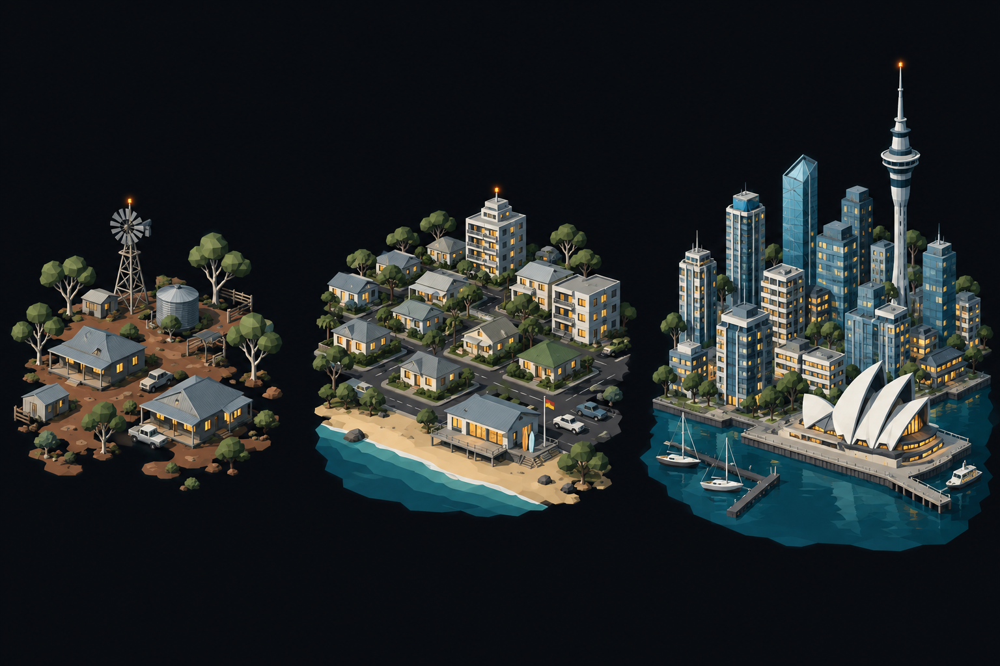

# Concept: Overworld settlement markers, Australian and New Zealand



- **Generator**: Codex CLI 0.154.0 built-in image generation, via `tools/art/gen-image.sh`.
- **Date**: 2026-09-16
- **Prompt file**: [`prompts/overworld-settlement-oceanian.txt`](prompts/overworld-settlement-oceanian.txt) (exact text passed to the generator, plus the standard save-path suffix the script appends)
- **Style guide refs**: §4.2 bug palette, §4.3 environment palette, §6 budgets
- **Drives**: `overworld.settlement.oceanian.{rural,town,city}` and `overworld.settlement-eggs.oceanian.{rural,town,city}` (#1155), built by `tools/art/models/settlement_styles.py` (`OCEANIAN`) on top of `settlement_parts.py`
- **Regions**: oceania (`src/graphics/data/settlement-styles.ts`)

## Prompt

```
Concept sheet for tiny strategic-map settlement markers from a near-future Earth turn-based tactics game, each a cluster of low-poly buildings standing directly on flat dark ground with no base, plate, disc or ring under them, seen from a three-quarter view about 55 degrees above so rooftops and one lit facade read together. Three clusters side by side on one row, a density ladder from left to right: first a rural hamlet, second a town, third a dense city block with one tall landmark. Architectural style: Australian and New Zealand. Rural: a scattered outback station of low single-storey houses with wide verandas and shallow corrugated metal roofs #6F7378, a windmill water pump, a water tank, red earth #7A6045, eucalyptus trees with pale trunks #AAA58F and grey-green crowns #66765B. Town: low coastal sprawl of one and two-storey houses with shallow tin roofs along a beach, a surf club, a few low apartment blocks. City: a harbourside skyline of glass towers #6E8FA6 with a tall needle observation tower with a disc top, and the landmark a white opera house of overlapping sail-shaped shells #E8ECF0 on the waterfront, harbour water #1F5C73 at one edge, eucalyptus between. Every building has small warm lit windows #FFD08A on the faces toward the viewer, and the tallest structure of each cluster carries one small orange beacon light #F08A24. Dark asphalt street gaps #3A3D42 between blocks. Low-poly game model style, flat shading, hard edges, clean vector-like fills with no gradients or noise, plain dark blue-black background #0B0D12, no text, no labels, no watermark, no logos. Wide landscape concept sheet showing the three clusters evenly spaced in one row.
```

## Keep

- Scattered single-storey houses with wide verandas and shallow tin roofs on red earth, a windmill pump and a water tank among eucalyptus for the hamlet; a low coastal sprawl for the town; glass towers with a needle observation tower and a white sail-shell opera house for the city.
- Grey-green eucalyptus crowns and pale trunks, unlike every other style's round green trees.

## Change next pass

- Beach, harbour water, boats, cars and red earth are dropped: the marker's ground is the map. The station keeps the windmill pump, a water tank and eucalyptus.
- The sail shells are three white prisms of stepped height on a small pier slab; the sheet's curved cladding is beyond the budget. The needle tower carries a drum below its tip.
