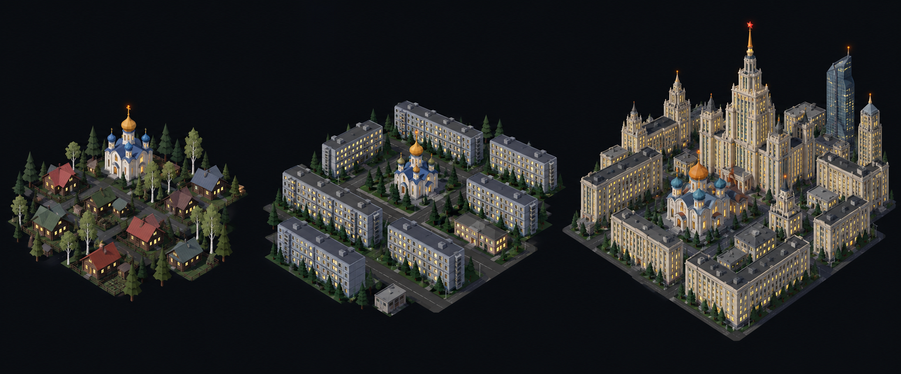

# Concept: Overworld settlement markers, Eastern European, Russian and Central Asian



- **Generator**: Codex CLI 0.154.0 built-in image generation, via `tools/art/gen-image.sh`.
- **Date**: 2026-09-16
- **Prompt file**: [`prompts/overworld-settlement-slavic.txt`](prompts/overworld-settlement-slavic.txt) (exact text passed to the generator, plus the standard save-path suffix the script appends)
- **Style guide refs**: §4.2 bug palette, §4.3 environment palette, §6 budgets
- **Drives**: `overworld.settlement.slavic.{rural,town,city}` and `overworld.settlement-eggs.slavic.{rural,town,city}` (#1155), built by `tools/art/models/settlement_styles.py` (`SLAVIC`) on top of `settlement_parts.py`
- **Regions**: eastern-europe, north-asia (`src/graphics/data/settlement-styles.ts`)

## Prompt

```
Concept sheet for tiny strategic-map settlement markers from a near-future Earth turn-based tactics game, each a cluster of low-poly buildings standing directly on flat dark ground with no base, plate, disc or ring under them, seen from a three-quarter view about 55 degrees above so rooftops and one lit facade read together. Three clusters side by side on one row, a density ladder from left to right: first a rural hamlet, second a town, third a dense city block with one tall landmark. Architectural style: Eastern Europe, Russia and Central Asia. Rural: log and timber houses #5A4634 with steep painted pitched roofs, a small white church with gold and blue onion domes, birch and fir trees. Town: wide long five-storey panel apartment slabs #9AA5B1 with flat roofs arranged in rows on wide streets, an onion-domed church in the middle, fir trees #3F6B33. City: massive wide slabs and Stalinist wedding-cake towers in pale stone #C8B990 with stepped tiers and central spires, a cluster of colourful onion domes #F08A24 #6E8FA6 on a cathedral, one modern glass tower, the landmark a tall stepped tower with a needle spire and a red star-like beacon. Every building has small warm lit windows #FFD08A on the faces toward the viewer, and the tallest structure of each cluster carries one small orange beacon light #F08A24. Dark asphalt street gaps #3A3D42 between blocks. Low-poly game model style, flat shading, hard edges, clean vector-like fills with no gradients or noise, plain dark blue-black background #0B0D12, no text, no labels, no watermark, no logos. Wide landscape concept sheet showing the three clusters evenly spaced in one row.
```

## Keep

- Wide five-storey panel slabs in rows around an onion-domed church, then Stalinist wedding-cake towers with a central needle and a red-star beacon: the slab-heavy footprint is the opposite of the East Asian slender towers.
- Log houses with steep painted roofs among fir and birch for the rural scale.

## Change next pass

- Gold domes are drawn with the bone token and blue ones with the visor cyan, with a rust dome on the larger churches; there is no gold in the token set.
- The sheet's city is far too dense for a 0.6 unit plot; the model keeps a three-tier wedding-cake landmark with a spire, one small onion cathedral among the slabs, and the city template's slabs.
