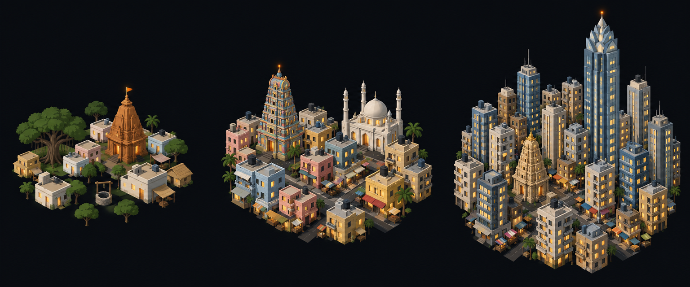

# Concept: Overworld settlement markers, South Asian



- **Generator**: Codex CLI 0.154.0 built-in image generation, via `tools/art/gen-image.sh`.
- **Date**: 2026-09-16
- **Prompt file**: [`prompts/overworld-settlement-south-asian.txt`](prompts/overworld-settlement-south-asian.txt) (exact text passed to the generator, plus the standard save-path suffix the script appends)
- **Style guide refs**: §4.2 bug palette, §4.3 environment palette, §6 budgets
- **Drives**: `overworld.settlement.south-asian.{rural,town,city}` and `overworld.settlement-eggs.south-asian.{rural,town,city}` (#1155), built by `tools/art/models/settlement_styles.py` (`SOUTH_ASIAN`) on top of `settlement_parts.py`
- **Regions**: south-asia (`src/graphics/data/settlement-styles.ts`)

## Prompt

```
Concept sheet for tiny strategic-map settlement markers from a near-future Earth turn-based tactics game, each a cluster of low-poly buildings standing directly on flat dark ground with no base, plate, disc or ring under them, seen from a three-quarter view about 55 degrees above so rooftops and one lit facade read together. Three clusters side by side on one row, a density ladder from left to right: first a rural hamlet, second a town, third a dense city block with one tall landmark. Architectural style: South Asian. Rural: a village of whitewashed and pastel houses #C8B990 with flat roofs and small parapets, a stepped Hindu temple shikhara tower in ochre stone #B86414 with a small flag, banyan trees #3F6B33, a well. Town: dense colourful low-rise blocks in pastel pink, yellow and blue with flat roofs and rooftop water tanks, a tall stepped temple gopuram tower with tiered carvings, a white marble dome with four small minarets. City: a crowded skyline of slender residential towers in cream #C8B990 and glass #6E8FA6, a stepped temple tower, the landmark a very tall glass tower with a crown shaped like a lotus or stepped pyramid, market streets between. Every building has small warm lit windows #FFD08A on the faces toward the viewer, and the tallest structure of each cluster carries one small orange beacon light #F08A24. Dark asphalt street gaps #3A3D42 between blocks. Low-poly game model style, flat shading, hard edges, clean vector-like fills with no gradients or noise, plain dark blue-black background #0B0D12, no text, no labels, no watermark, no logos. Wide landscape concept sheet showing the three clusters evenly spaced in one row.
```

## Keep

- Whitewashed and pastel flat-roofed houses with parapets and rooftop tanks, a stepped shikhara in ochre stone on the hamlet, a tiered gopuram and a white marble dome with four minarets in the town, and a very tall glass tower with a lotus crown over slender cream residential towers in the city.
- Pastel pink, yellow and blue facades against cream, which no other style uses.

## Change next pass

- The gopuram's carvings are drawn as texture; the model builds it as a six-tier stepped pyramid in the ochre token, and the hamlet's shikhara as a five-tier one.
- The city tower's lotus crown becomes three stepped slabs, the first wider than the tower, so the silhouette still reads as a crowned spike; the white tomb with four minarets sits in the town only.
