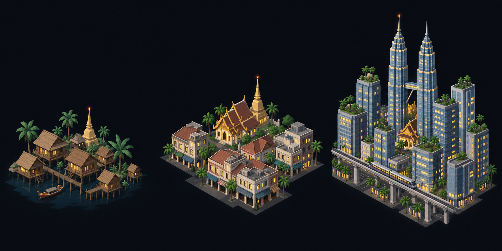

# Concept: Overworld settlement markers, Southeast Asian



- **Generator**: Codex CLI 0.154.0 built-in image generation, via `tools/art/gen-image.sh`.
- **Date**: 2026-09-16
- **Prompt file**: [`prompts/overworld-settlement-southeast-asian.txt`](prompts/overworld-settlement-southeast-asian.txt) (exact text passed to the generator, plus the standard save-path suffix the script appends)
- **Style guide refs**: §4.2 bug palette, §4.3 environment palette, §6 budgets
- **Drives**: `overworld.settlement.southeast-asian.{rural,town,city}` and `overworld.settlement-eggs.southeast-asian.{rural,town,city}` (#1155), built by `tools/art/models/settlement_styles.py` (`SOUTHEAST_ASIAN`) on top of `settlement_parts.py`
- **Regions**: southeast-asia (`src/graphics/data/settlement-styles.ts`)

## Prompt

```
Concept sheet for tiny strategic-map settlement markers from a near-future Earth turn-based tactics game, each a cluster of low-poly buildings standing directly on flat dark ground with no base, plate, disc or ring under them, seen from a three-quarter view about 55 degrees above so rooftops and one lit facade read together. Three clusters side by side on one row, a density ladder from left to right: first a rural hamlet, second a town, third a dense city block with one tall landmark. Architectural style: Southeast Asian. Rural: a village of wooden stilt houses #786348 with steep thatched or tiled roofs raised on posts over water, a small golden stupa #DDC39B, banana and palm trees #39714E, a boat. Town: low concrete shophouses #C8B990 with tiled roofs and shaded arcades, a golden Buddhist temple with a tiered steep roof and a bell-shaped golden stupa spire, palms. City: a skyline of glass towers #6E8FA6 with tropical rooftop gardens, an elevated rail viaduct, the landmark a pair of slender twin towers joined by a sky bridge with pointed spires, a golden temple roof glinting between them, palms along the streets. Every building has small warm lit windows #FFD08A on the faces toward the viewer, and the tallest structure of each cluster carries one small orange beacon light #F08A24. Dark asphalt street gaps #3A3D42 between blocks. Low-poly game model style, flat shading, hard edges, clean vector-like fills with no gradients or noise, plain dark blue-black background #0B0D12, no text, no labels, no watermark, no logos. Wide landscape concept sheet showing the three clusters evenly spaced in one row.
```

## Keep

- Stilt houses with steep thatched roofs raised over water, a golden stupa and palms for the hamlet; tiled shophouses with an arcaded ground floor and a golden tiered temple for the town; twin spired towers joined by a sky bridge above rooftop gardens and an elevated rail viaduct for the city.
- The gold stupa and the twin-tower sky bridge are the two silhouettes the model keeps.

## Change next pass

- Water is one thin rectangular slab under the boat in the companion slot, not a shoreline around the hamlet, so the marker still stands on the map rather than on a plate.
- The rail viaduct is dropped; it is a long thin element that aliases at map zoom. The city keeps the twin drum towers with spires, the sky bridge and a small golden temple between them.
