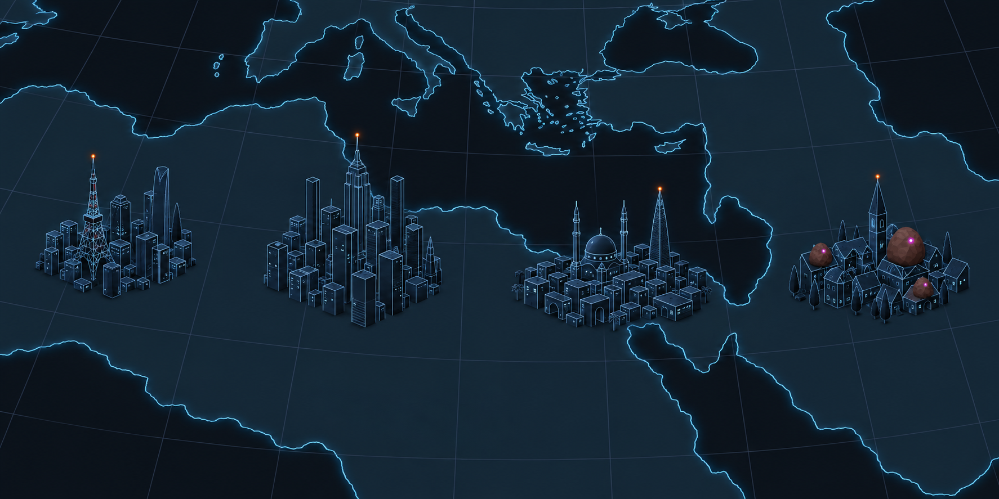

# Concept: Overworld settlement markers on the WarGames display



- **Generator**: Codex CLI built-in image generation, via `tools/art/gen-image.sh`.
- **Date**: 2026-09-16
- **Prompt file**: [`prompts/overworld-settlement-wargames.txt`](prompts/overworld-settlement-wargames.txt) (exact text passed to the generator, plus the standard save-path suffix the script appends)
- **Style guide refs**: §4.4 UI tokens (`ui-bg`, `ui-info`, `ui-line`), §4.1 `tdf-orange`, §4.2 egg tokens
- **Drives**: `src/graphics/service/settlement-display-look.ts` and its tuning `src/graphics/data/settlement-display-tuning.ts` (#1155): the renderer-side restyle every `overworld.settlement.*` GLB gets as it loads for the strategic map
- **Supersedes on the map**: the full-colour look of the ten regional sheets (`overworld-settlement-<style>.md`), which remain the authored palette of the GLBs and the reference for silhouette and dressing

## Why

The strategic map is a WarGames NORAD board (#1144): cyan coastlines with a glow, a dim graticule, a near-black slab. The regional settlements landed on it in their tactical-palette colours (ochre roofs, sand, blue glass, turquoise domes, green trees, warm windows) and clashed with the display. This sheet asks for the same clusters restyled to belong to it.

## Prompt

```
Concept sheet restyling the tiny strategic-map city markers of a near-future Earth turn-based tactics game so they belong to the map they stand on. The map is a WarGames NORAD-board style vector display: a flat near-black blue slab #0B0D12 seen from a high orthographic view pitched about 35 degrees, north up; continents drawn only as thin glowing cyan coastlines #7FD1FF with a soft cyan halo, a faint 30-degree latitude and longitude graticule in dim grey-blue #2E3646, land filled with the same cyan at ten percent so the continents read as ghosted shapes, no terrain, no texture. Show a section of this map (a coastline curving through the frame, graticule lines crossing it) with four low-poly city clusters standing directly on the slab with no base, plate, disc or ring under them, each about the size of a thumbnail. The clusters must read as part of the same monochrome display: every building is a dark desaturated navy mass #1B2230 with flat faces, and its silhouette and roof edges are picked out as thin crisp cyan wire lines #7FD1FF at low intensity, like a wireframe drawn over a solid, so the skyline reads as light lines on dark. A few small dim cyan-white window points #9FD8F0 dot the faces toward the viewer, sparse, never a wash. The tallest landmark of each cluster carries one tiny orange beacon light #F08A24, the only warm colour on the sheet. No vegetation colour: trees, if any, are the same dark navy forms with no green. No streets drawn. Left to right: a Tokyo-like cluster of slender tapered towers with a lattice tower; a Manhattan-like tight grid of box skyscrapers with a stepped needle tower; a Cairo-like cluster of flat-roofed cubes with a large dome, two minarets and one tapering glass needle; and a small European village of pitched roofs and a church spire whose roofs are overgrown by three russet-brown alien egg mounds #73452E with a magenta glow spot #E23DFF on each egg, the only other colour on the sheet, so the infested town pops against the cyan display. Low-poly game model style, flat shading, hard edges, clean vector-like fills with no gradients, grain or noise, no text, no labels, no watermark, no logos. Wide landscape sheet.
```

## Keep

- Dark navy building masses with the silhouette and roof edges drawn as cyan wire over the solid: the skyline reads as light lines on dark, the same vocabulary as the coastlines, and the regional silhouettes (lattice tower, stepped needle, dome and minarets, spire) still tell the cities apart.
- Sparse dim window points and one orange beacon per cluster as the only warm colour; eggs in russet with magenta spots as the only other colour, which is exactly the mission cue's job.
- No vegetation colour: trees are dark forms.

## How it is implemented

The look is a rendering property of the strategic map, not of the buildings, so it is applied in the renderer rather than authored into the sixty GLBs: `SettlementDisplayLook` swaps each settlement's materials by their palette token (bodies to `#1B2230` lit, windows `#9FD8F0` unlit, `tdf-orange` beacon kept, foliage `#111722`) and adds an `EdgesGeometry` overlay at a 30° crease threshold in `ui-info` cyan, faded with the zoom (0.14 at the world zoom, 0.55 by 150 px per unit) so the world view is not line noise. The GLBs keep the authored palette, so `docs/design/renders/` and the regional sheets stay the true-colour reference; the only authoring change was to stop three styles using the beacon's `tdf-orange` token on walls and lattice bands, which the display would otherwise light orange.

## Change next pass

- The beacon block (0.035 u) reads as a square at the regional zoom where the sheet has a point; a smaller block or a sprite would match the sheet.
- The installations (battery, dispersal, sensor array) still wear their tactical palette on the map; the same dresser can take them once their silhouettes have been checked in the dark tone.
