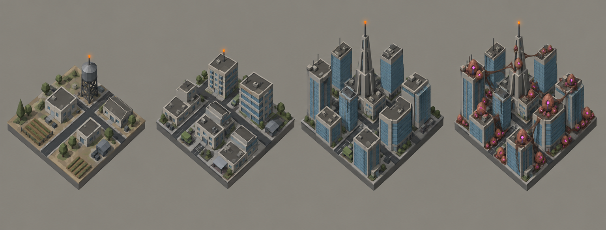

# Concept: Overworld settlement markers

> Superseded on 2026-09-16 by the ten regional sheets (`overworld-settlement-<style>.md`, #1155): settlements now vary by region, stand directly on the map with no plate, and the egg overlay is built per style. This sheet remains as the origin of the three-scale density ladder.



- **Generator**: Codex CLI 0.154.0 built-in image generation, via `tools/art/gen-image.sh`.
- **Date**: 2026-09-16
- **Prompt file**: [`prompts/overworld-settlement.txt`](prompts/overworld-settlement.txt) (exact text passed to the generator, plus the standard save-path suffix the script appends)
- **Style guide refs**: §4.2 bug palette, §4.3 environment palette, §6 budgets
- **Drives** (historical): the original `overworld.settlement.{rural,town,city}` and `overworld.settlement-eggs.{rural,town,city}` (#1152), since replaced by `overworld.settlement.<style>.<scale>` built by `tools/art/models/settlement_styles.py`

## Prompt

```
Concept sheet for tiny strategic-map settlement markers from a near-future Earth turn-based tactics game, each a cluster of low-poly buildings on a small square plot 0.6 units wide, seen from a top-down three-quarter view about 60 degrees above so the rooftop pattern reads clearly. Four plots side by side on one row: first a rural hamlet with three or four low flat blocks and one water tower or grain silo; second a town with a tighter cluster of blocks and a couple of mid-rise slabs; third a dense city block of towers of varied heights around one tall landmark spire; fourth the same city block infested with alien eggs, clusters of translucent ovoid eggs piled on rooftops and wedged in the street gaps, thin dark webbing strands bridging the rooftops. Buildings vary in height with narrow street gaps so the grid pattern shows from above. Colours: concrete walls #8E8A82, dark asphalt streets #3A3D42, blue-grey glass towers #6E8FA6, flat roofs #55524C, steel tanks and spire #6F7378, one bright orange beacon light #F08A24 on the tallest building of each plot; eggs russet flesh #73452E with membrane highlights #956344 and glowing magenta spots #E23DFF, webbing dark walnut chitin #5C3B25. Low-poly game model style, flat shading, hard edges, clean vector-like fills with no gradients or noise, plain neutral grey background #8E8A82, no text, no labels, no watermark, no logos. Wide landscape concept sheet showing the four plots evenly spaced in one row.
```

## Keep

- The three scales read as a density ladder: a few low blocks with one water tower, a tight cluster with two glass mid-rises, a full grid of towers around one spire. Each plot carries one orange beacon on its tallest structure.
- Eggs sit on rooftops and in the street gaps with dark webbing bridging the towers, so the infested plot is unmistakable while the city grid stays visible underneath.

## Change next pass

- The concept is drawn at 35°; the game views these markers from straight above at 20 to 40 px, so the models drop the trees, cars and window detail and keep only roof-height variance and street gaps.
- Rural crop rows and green grounds are not in the environment token set for the marker; the models use an asphalt plate for every scale so the three read as one family on the dark map.
