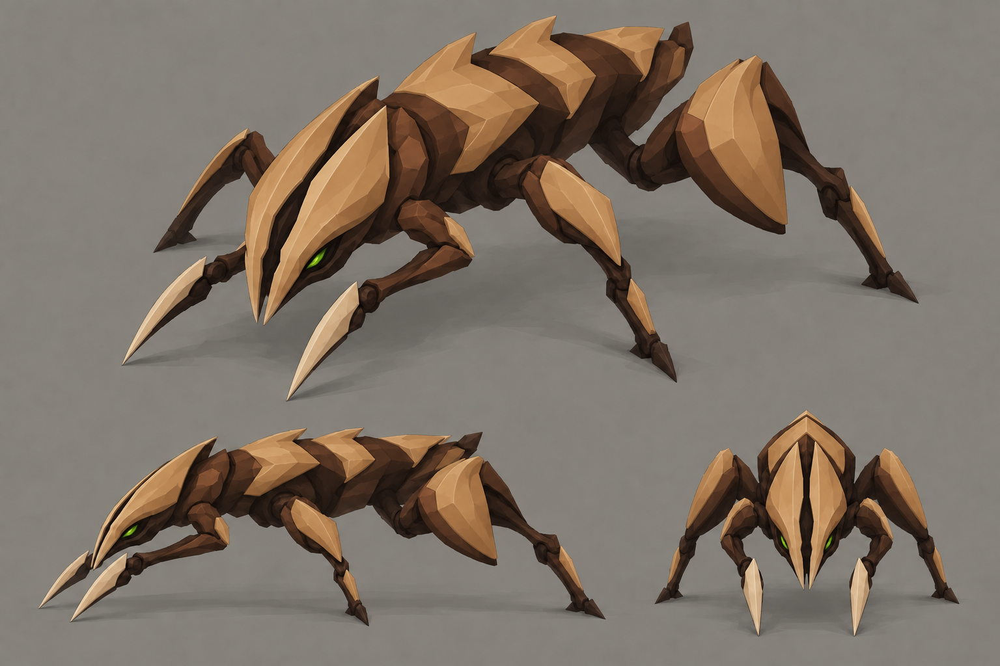
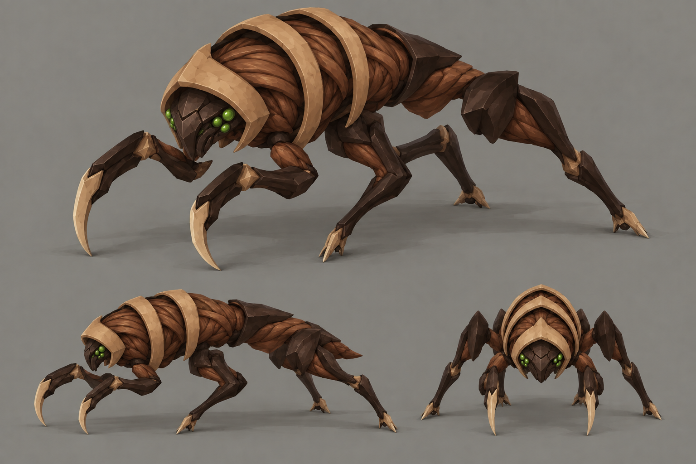

# Swarmer redesign — brown Crescent selected

**Selected · 2026-09-12.** The Executive Director chose **B — Crescent in brown** and requested detailed replacement 3D models for the whole family. The [Crescent bug kit](../../kits/crescent-bugs.md) contains the implemented swarmer, lurker, brute and egg spawner, exported models, renders and an interactive preview. A and C remain archived alternatives.

Each sheet contains a large three-quarter view, a side profile and a front view. Click a preview for the full 1536×1024 image.

| A — Splitmask | B — Crescent | C — Ribknife |
|---|---|---|
|  |  |  |
| **Lean shell hunter.** A tan divided face and repeated chevrons make an arrow pointing into the attack. | **Prehistoric skitterer.** A thin crescent hood gives the swarm a broad, unfamiliar outline. | **Exposed biology.** External ribs and flexible tissue make a creature that looks grown and vulnerable. |
| [Notes and edit prompt](a-splitmask-brown.md) | [Notes and edit prompt](b-crescent-brown.md) | [Notes and edit prompt](c-ribknife-brown.md) |

## Brown palette

Walnut and chestnut replace the purple chitin. Large pale plates become toasted tan; dark umber joints and small pale cutting edges retain contrast. Ribknife's wine-red membranes become russet brown. All three keep their small green eye accents. The colour edit preserves the existing designs, poses and three-view composition so the new palette can be judged across the same forms.

These colour targets now also define the runtime bug material tokens in the [style guide](../../style-guide.md):

| Use | Target |
|---|---|
| Main chitin | Walnut `#5C3B25` |
| Raised chitin | Chestnut `#8B5D36` |
| Joints / blade backs | Dark umber `#2E2118` |
| Large plates / ribs | Toasted tan `#B88B58`, sandy highlights `#C6A275` |
| Narrow cutting edges | Pale horn `#DDC39B` |
| Ribknife tissue | Russet `#73452E`, highlights `#956344` |
| Small eye / vent accents | Existing green `#9CFF3D` |

Earlier palette studies remain available for comparison: [A — Splitmask](a-splitmask.md), [B — Crescent](b-crescent.md), [C — Ribknife](c-ribknife.md).

## Selected direction and implementation

The Crescent's thin, swept hood, tan dorsal lozenges and hooked forelimbs define the family. The swarmer keeps the broadest, lowest shield. The lurker stretches the hood and hooks into a narrow stalker with long sickles. The brute carries a thick mantle and overlapping back plates. The spawner repeats shell rims and tan ribs around its clutch and opening crown.

The approved detail pass replaces the old polygon budgets with class budgets of 16,000 / 18,000 / 20,000 triangles for swarmer / lurker / brute and 16,000 for the spawner, while keeping each GLB below 500 KiB. All three moving bugs have four running legs and two blade arms. See the [kit review](../../kits/crescent-bugs.md) for actual counts, dimensions, animation checks and ground reads.

The generated sheets are visual references, not measured turnarounds. The authored models resolve their small anatomy differences and are the current implementation reference. The [original swarmer concept](../bug-swarmer.md) and the A/C explorations remain design history.

## Provenance

Generated on **2026-09-12** with the **built-in `image_gen` tool** using the imagegen skill. The tool does not expose the image-model version. Each original sheet was an independent generation with no image inputs. Each brown revision is an image edit using its corresponding original sheet as the sole input. PNG outputs are saved unmodified at their generated 1536×1024 resolution.

Exact brown edit prompts: [A](prompts/a-splitmask-brown.txt), [B](prompts/b-crescent-brown.txt), [C](prompts/c-ribknife-brown.txt). Original generation prompts: [A](prompts/a-splitmask.txt), [B](prompts/b-crescent.txt), [C](prompts/c-ribknife.txt). Each image has a Markdown sidecar with review notes. To reproduce an edit, pass its prompt and the named original image to the built-in image tool and save the result under a new filename in this directory.
