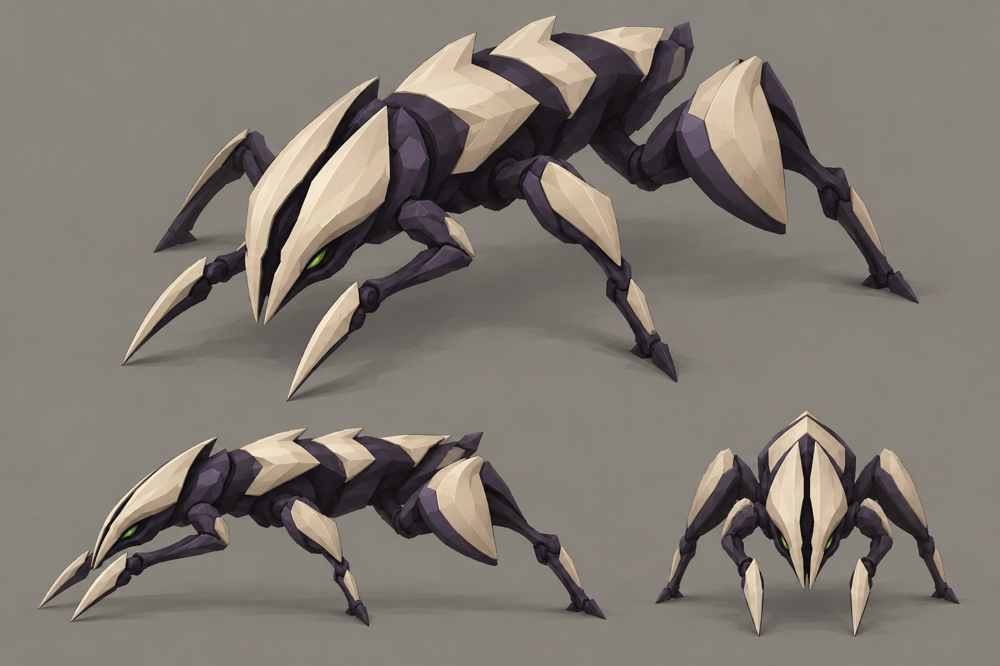

# Swarmer concept A — Splitmask

- **Status:** proposal for review; [compare all three directions](README.md).
- **Generator:** built-in `image_gen`, image model as served by the tool; imagegen skill, default built-in mode.
- **Date:** 2026-09-12.
- **Asset:** `a-splitmask.png`, 1536×1024, unmodified tool output.
- **Exact prompt:** [`prompts/a-splitmask.txt`](prompts/a-splitmask.txt). No image inputs or appended prompt suffix.
- **References:** [GDD §3 and §6.4](../../gdd.md), [style guide §3, §4.2 and §6](../../style-guide.md).

## Direction

An arrow-shaped hunter with a divided pale face and overlapping ivory shell chevrons. It explores much more bone coverage than the original dark swarmer. Dark joints and small green eye recesses separate the large plates.

## Keep

- The black cleft through the pale face: a distinctive family motif visible from the front and above.
- Three large dorsal chevrons separated by dark joints, a tapered body and short pointed foreblades.
- Folded rear haunches that suggest a quick launch into a running attack.

## Resolve if selected

Thin the plates and reduce haunch bulk so this reads as a fragile swarmer. Keep the overall height at 0.5 u and the legs tucked within its tile. Simplify painted faceting into a few intentional planes. The concept's pale shapes suggest useful contrast, but readability on game terrain still needs a real model test.
