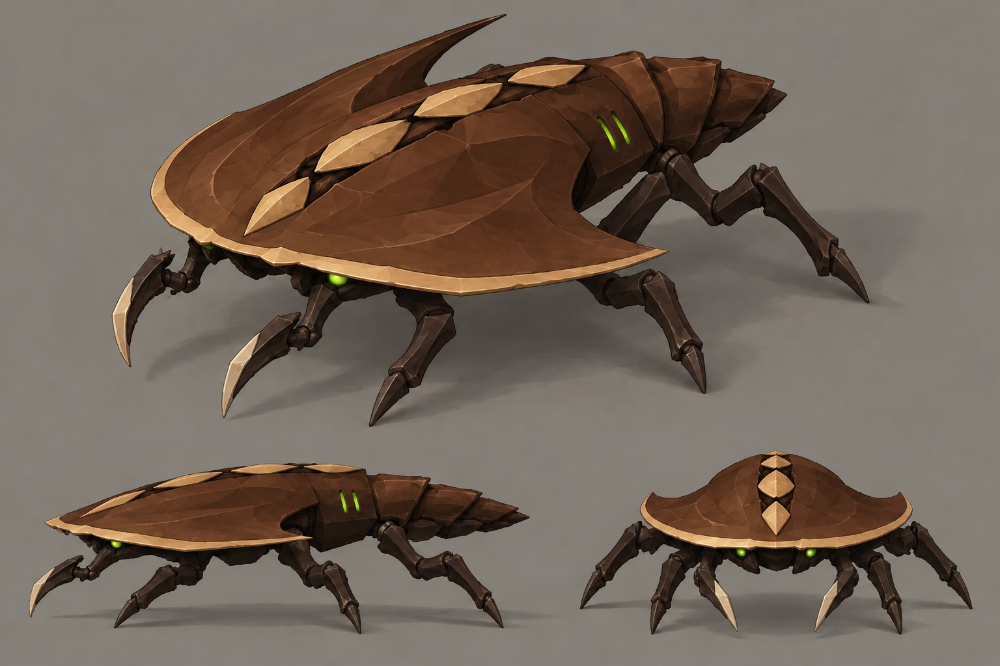

# Swarmer concept B — Crescent, brown revision

- **Status:** current colour proposal; [compare all three directions and palette targets](README.md).
- **Generator:** built-in `image_gen`, imagegen skill, image-edit mode; image model as served by the tool.
- **Date:** 2026-09-12.
- **Asset:** `b-crescent-brown.png`, 1536×1024, unmodified tool output.
- **Exact prompt:** [`prompts/b-crescent-brown.txt`](prompts/b-crescent-brown.txt), no appended suffix.
- **Sole input / edit target:** [`b-crescent.png`](b-crescent.png); [original design notes](b-crescent.md).

The crescent shield and abdomen are chestnut/walnut brown, with tan dorsal marks and a light shield lip. Limbs and joints are dark umber, while eyes and the two short vent marks retain their green accents. The shield outline, anatomy and three views retain the original design.

Visual review: this has the broadest uninterrupted brown surface of the three. Preserve the contrasting rim and dorsal marks in a later model so the shell remains readable on brown ground. Keep the shield thin to retain the swarmer read; the original plate-count and silhouette notes still apply.
