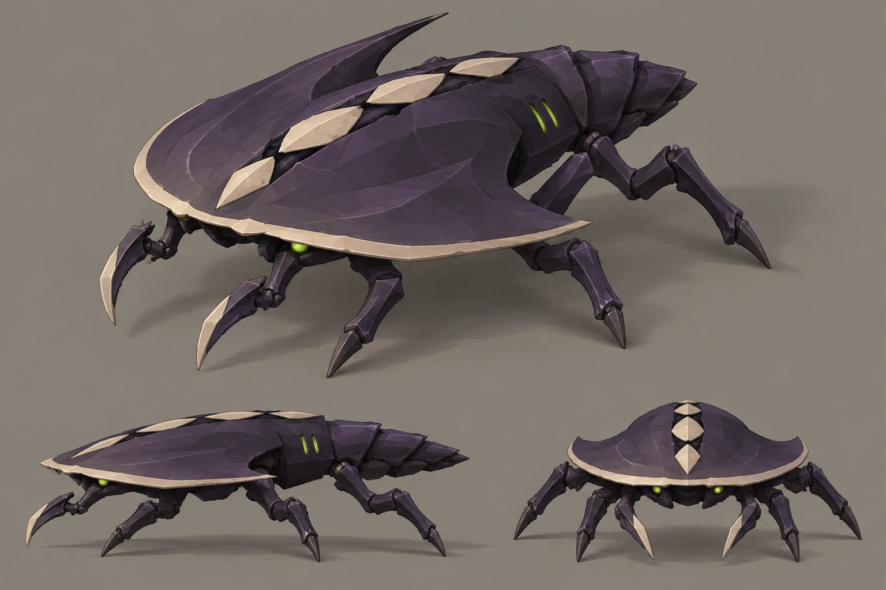

# Swarmer concept B — Crescent

- **Status:** proposal for review; [compare all three directions](README.md).
- **Generator:** built-in `image_gen`, image model as served by the tool; imagegen skill, default built-in mode.
- **Date:** 2026-09-12.
- **Asset:** `b-crescent.png`, 1536×1024, unmodified tool output.
- **Exact prompt:** [`prompts/b-crescent.txt`](prompts/b-crescent.txt). No image inputs or appended prompt suffix.
- **References:** [GDD §3 and §6.4](../../gdd.md), [style guide §3, §4.2 and §6](../../style-guide.md).

## Direction

A prehistoric skitterer with a swept crescent hood, trailing segmented abdomen and small hooked forelimbs. Pale edging and separated dorsal lozenges mark the dark shell. This explores the largest departure from the current arrow silhouette.

## Keep

- A broad, low head shield with a thin cutting edge and swept rear corners.
- A visible narrow abdomen that establishes which way the creature is moving.
- Small independent blade arms beneath the hood and restrained green eyes/vents.

## Resolve if selected

Keep the shield thin and the body slight to distinguish it from the brute's heavy dome. Shorten the swept tips enough to fit the one-tile footprint. Standardize the dorsal marks: the prompt requests three lozenges, while the hero/front studies suggest four. Preserve a segmented pale centreline and choose its final count in the authored turnaround. Remove the painting's crack-like surface detail from the game model.
