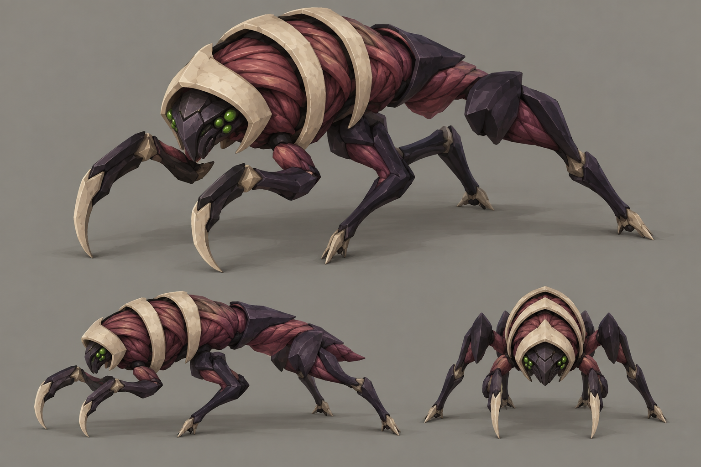

# Swarmer concept C — Ribknife

- **Status:** proposal for review; [compare all three directions](README.md).
- **Generator:** built-in `image_gen`, image model as served by the tool; imagegen skill, default built-in mode.
- **Date:** 2026-09-12.
- **Asset:** `c-ribknife.png`, 1536×1024, unmodified tool output.
- **Exact prompt:** [`prompts/c-ribknife.txt`](prompts/c-ribknife.txt). No image inputs or appended prompt suffix.
- **References:** [GDD §3 and §6.4](../../gdd.md), [style guide §3, §4.2 and §6](../../style-guide.md).

## Direction

A sinewy insect whose intact wine-red membranes sit between pale external ribs. The tucked dark face and short hooked blades make it a close-range hunter. Greater flesh coverage explores a more unsettling, visibly vulnerable swarm.

## Keep

- Three pale rib arches as the repeated family motif, with clear dark gaps between them.
- A small head under the front arch, compact green eye clusters and dark limb caps.
- The contrast between flexible tissue and hard cutting edges; it suggests a creature grown for one purpose.

## Resolve if selected

Lower the arched thorax and shorten the hanging hooks to keep the low swarmer read distinct from the tall lurker. Replace the dense painted muscle strands with two or three broad flesh bands. Simplify the feet to insect tips and resolve their slight variation between studies. Check the red/bone balance on actual terrain: this is the biggest material-coverage departure of the three.
